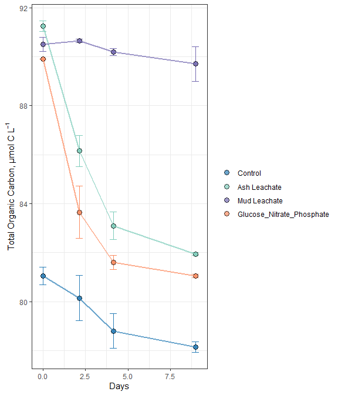

2018\_TOC
================
Samantha Chen
11/11/2020

# Intro

This document will show how **individual bottle** TOC/DOC data from 2018
remineralization experiments were processed, QC’d, and analyzed.

``` r
library(tidyverse)
library(readxl)
library(lubridate)
```

``` r
excel_sheets("~/GitHub EEMB 144L/144l_students/Input_Data/week4/144L_2018_Exp_TOC.xlsx")
```

    ## [1] "Metadata" "Data"

``` r
metadata <- read_excel("~/GitHub EEMB 144L/144l_students/Input_Data/week4/144L_2018_Exp_TOC.xlsx", sheet = "Metadata")

data <- read_excel("~/GitHub EEMB 144L/144l_students/Input_Data/week4/144L_2018_Exp_TOC.xlsx", sheet = "Data")

joined_data <- left_join(metadata, data)
```

    ## Joining, by = c("Bottle", "Timepoint")

``` r
toc <- joined_data %>% 
  mutate(Datetime = ymd_hm(Datetime)) %>% 
  group_by(Bottle, Treatment) %>% 
  mutate(interv = interval(first(Datetime), Datetime),
         hours = as.numeric(interv)/3600,
         days = hours/24) %>% 
  ungroup() %>%
  rename(sd_TOC = TOC_sd,
         sd_PTOC = PTOC_sd) %>% 
  select(Experiment:Datetime, TOC:days)
```

``` r
pivot_toc <- toc %>% 
  select(Experiment, Location, Bottle, Treatment, days, TOC, PTOC) %>% 
  pivot_longer(TOC:PTOC, names_to = "sample", values_to = "value") #expand rows, decrease columns

pivot_toc_sd <- toc %>% 
  select(Experiment, Location, Bottle, Treatment, days, sd_TOC, sd_PTOC) %>% 
  pivot_longer(sd_TOC:sd_PTOC, names_to = "sample", names_prefix = "sd_", values_to = "sd")

pivoted <- left_join(pivot_toc, pivot_toc_sd) %>% 
  mutate(sample = ifelse(sample == "TOC", "Bottle", "Vial"))
```

    ## Joining, by = c("Experiment", "Location", "Bottle", "Treatment", "days", "sample")

``` r
view(pivoted)
```

# TOC Plot

``` r
custom.colors <- c("Control" = "#2c7fb8", "Ash Leachate" = "#7fcdbb", "Mud Leachate" = "#756bb1", "Glucose_Nitrate_Phosphate" = "#fc8d62", "Bottle" = "#c51b8a", "Vial" = "#1f78b4")
levels <- c("Control", "Ash Leachate", "Mud Leachate", "Glucose_Nitrate_Phosphate", "Bottle", "Vial")

pivoted %>% 
  drop_na(value) %>% 
  mutate(Treatment = factor(Treatment, levels = levels),
        sample = factor(sample, levels = levels)) %>% 
  ggplot(aes(x = days, y = value, group = interaction(Treatment, Bottle))) +
  geom_errorbar(aes(ymin = value - sd, ymax = value + sd, color = sample), width = 0.4) +
  geom_point(aes(fill = sample), size = 3, shape = 21, alpha = 0.7) +
  scale_color_manual(values = custom.colors) +
  scale_fill_manual(values = custom.colors) +
  labs(x = "Days", y = expression("Total Organic Carbon µmol C L"^-1), color = "", fill = "") +
  theme_bw() +
  facet_grid(rows = "Treatment", scales = "free") +
  guides(color = F)
```

<!-- --> Ash and GNP
follows a very similar trend in which TOC decreases as days increases.
You don’t see a dramatic decrease in TOC in Mud and Control compared to
Ash and GNP.

The analytical detection limit for our TOC analysis is \~1.5 µmol C L
^-1.

# TOC v. PTOC (Bottle v. Vial Samples)

``` r
# install.packages("lmodel2")
library(lmodel2)

reg.data <- toc %>% 
  drop_na(TOC) %>% 
  filter(Timepoint > 0)

reg <- lmodel2(PTOC ~ TOC, data = reg.data, nperm = 99)

reg
```

    ## 
    ## Model II regression
    ## 
    ## Call: lmodel2(formula = PTOC ~ TOC, data = reg.data, nperm = 99)
    ## 
    ## n = 16   r = 0.9604998   r-square = 0.9225598 
    ## Parametric P-values:   2-tailed = 3.623619e-09    1-tailed = 1.811809e-09 
    ## Angle between the two OLS regression lines = 2.307491 degrees
    ## 
    ## Permutation tests of OLS, MA, RMA slopes: 1-tailed, tail corresponding to sign
    ## A permutation test of r is equivalent to a permutation test of the OLS slope
    ## P-perm for SMA = NA because the SMA slope cannot be tested
    ## 
    ## Regression results
    ##   Method Intercept     Slope Angle (degrees) P-perm (1-tailed)
    ## 1    OLS  1.291392 0.9890968        44.68594              0.01
    ## 2     MA -2.226082 1.0310159        45.87490              0.01
    ## 3    SMA -2.121795 1.0297731        45.84037                NA
    ## 
    ## Confidence intervals
    ##   Method 2.5%-Intercept 97.5%-Intercept 2.5%-Slope 97.5%-Slope
    ## 1    OLS      -12.50802        15.09081  0.8248319    1.153362
    ## 2     MA      -17.99796        11.05134  0.8727838    1.218975
    ## 3    SMA      -16.99788        10.56939  0.8785273    1.207057
    ## 
    ## Eigenvalues: 34.74849 0.6994871 
    ## 
    ## H statistic used for computing C.I. of MA: 0.006888855

``` r
intercept <- reg$regression.results[3,2]
slope <- reg$regression.results[3,3]

two_int <- reg$confidence.intervals[3,2]
two_slope <- reg$confidence.intervals[3,4]
nine_int <- reg$confidence.intervals[3,3]
nine_slope <- reg$confidence.intervals[3,5]
```

``` r
reg.data %>% 
  ggplot(aes(x = TOC, y = PTOC)) +
  geom_errorbar(aes(ymin = PTOC - sd_PTOC, ymax = PTOC + sd_PTOC), width = 0.05) +
  # geom_errorbarh(aes(xmin = TOC - sd_TOC, xmax = PTOC + sd_PTOC), width = 0.05) +
  geom_point(fill = "white", shape = 21, size = 4, alpha = 0.7) +
  geom_abline(intercept = intercept, slope = slope, linetype = 2, size = 1) +
  geom_abline(intercept = two_int, slope = two_slope, color = "black", linetype = 3, size = 1) +
  geom_abline(intercept = nine_int, slope = nine_slope, color = "black", linetype = 3, size = 1) +
  labs(x = expression("Bottle TOC, µmol C L"^-1), y = expression("Vial TOC, µmol C L"^-1)) +
  theme_bw() +
  annotate( geom = "text", label = expression(atop("y = 1.03x - 2.12", paste("r"^2," = 0.97, ", italic("p "), "= 0.01"))), x = 90, y = 85, size = 3)
```

    ## Warning in is.na(x): is.na() applied to non-(list or vector) of type
    ## 'expression'

<!-- -->

This regression indicates a positive correlation between Bottle TOC and
Vial TOC. Slope = 1.03 µmol C L ^-1 and intercept = -2.12. R value =
0.97 indicating a strong linear relationship. P value = 0.01 which is
\<0.05 indicating a statistically significant correlation.

``` r
bc <- read_rds("~/GitHub EEMB 144L/144l_students/Output_Data/2018_BactAbund.rds") %>% 
  select(-c(hours, days))

merge <- left_join(toc, bc) %>% 
  select(Experiment:days, TOC:sd_PTOC, cells:diff_ln_cells, bc, ave_bc, sd_bc, everything(), -c(contains("Sample"))) %>% 
  group_by(Experiment, Treatment, Bottle) %>% 
  fill(start_exp:sd_lag) %>% 
  ungroup()
```

    ## Joining, by = c("Experiment", "Location", "Temperature", "Depth", "Bottle", "Timepoint", "Treatment", "Target_DOC_Amendment", "Inoculum_L", "Media_L", "Datetime")

``` r
glimpse(merge)
```

    ## Rows: 80
    ## Columns: 46
    ## $ Experiment           <chr> "144L_2018", "144L_2018", "144L_2018", "144L_2...
    ## $ Location             <chr> "Campus Point", "Campus Point", "Campus Point"...
    ## $ Temperature          <dbl> 20, 20, 20, 20, 20, 20, 20, 20, 20, 20, 20, 20...
    ## $ Depth                <dbl> 1, 1, 1, 1, 1, 1, 1, 1, 1, 1, 1, 1, 1, 1, 1, 1...
    ## $ Bottle               <chr> "A", "A", "A", "A", "A", "A", "A", "A", "A", "...
    ## $ Timepoint            <dbl> 0, 1, 2, 3, 4, 5, 6, 7, 8, 9, 0, 1, 2, 3, 4, 5...
    ## $ Treatment            <chr> "Control", "Control", "Control", "Control", "C...
    ## $ Target_DOC_Amendment <dbl> 0, 0, 0, 0, 0, 0, 0, 0, 0, 0, 0, 0, 0, 0, 0, 0...
    ## $ Inoculum_L           <dbl> 1.5, 1.5, 1.5, 1.5, 1.5, 1.5, 1.5, 1.5, 1.5, 1...
    ## $ Media_L              <dbl> 3.5, 3.5, 3.5, 3.5, 3.5, 3.5, 3.5, 3.5, 3.5, 3...
    ## $ Datetime             <dttm> 2018-10-15 16:30:00, 2018-10-16 08:00:00, 201...
    ## $ TOC                  <dbl> 81.30000, NA, NA, NA, 81.77997, NA, NA, NA, 78...
    ## $ sd_TOC               <dbl> 0.40000000, NA, NA, NA, NA, NA, NA, NA, 0.3872...
    ## $ PTOC                 <dbl> 81.3, NA, NA, NA, 79.5, NA, NA, NA, 78.3, 78.0...
    ## $ sd_PTOC              <dbl> 0.4, NA, NA, NA, 0.6, NA, NA, NA, 0.2, 0.6, 0....
    ## $ interv               <Interval> 2018-10-15 16:30:00 UTC--2018-10-15 16:30...
    ## $ hours                <dbl> 0.0, 15.5, 27.5, 39.5, 51.5, 63.5, 75.5, 87.5,...
    ## $ days                 <dbl> 0.0000000, 0.6458333, 1.1458333, 1.6458333, 2....
    ## $ cells                <dbl> 332531522, 523943125, 859019934, 906998856, 93...
    ## $ ln_cells             <dbl> 19.62225, 20.07689, 20.57130, 20.62565, 20.653...
    ## $ diff_ln_cells        <dbl> 0.000000000, 0.454648479, 0.494408990, 0.05434...
    ## $ bc                   <dbl> 0.8313288, 1.3098578, 2.1475498, 2.2674971, 2....
    ## $ ave_bc               <dbl> 0.9022187, 1.3301541, 1.9535757, 2.3515191, 2....
    ## $ sd_bc                <dbl> 0.10025342, 0.02870334, 0.27432087, 0.11882499...
    ## $ start_exp            <dbl> 0, 0, 0, 0, 0, 0, 0, 0, 0, 0, 0, 0, 0, 0, 0, 0...
    ## $ end_exp              <dbl> 1, 1, 1, 1, 1, 1, 1, 1, 1, 1, 1, 1, 1, 1, 1, 1...
    ## $ ln_cells_start_exp   <dbl> 19.62225, 19.62225, 19.62225, 19.62225, 19.622...
    ## $ ln_cells_end_exp     <dbl> 20.07689, 20.07689, 20.07689, 20.07689, 20.076...
    ## $ cells_start_exp      <dbl> 332531522, 332531522, 332531522, 332531522, 33...
    ## $ cells_end_exp        <dbl> 523943125, 523943125, 523943125, 523943125, 52...
    ## $ days_start_exp       <dbl> 0, 0, 0, 0, 0, 0, 0, 0, 0, 0, 0, 0, 0, 0, 0, 0...
    ## $ days_end_exp         <dbl> 0.6458333, 0.6458333, 0.6458333, 0.6458333, 0....
    ## $ mew                  <dbl> 0.7039718, 0.7039718, 0.7039718, 0.7039718, 0....
    ## $ doubling             <dbl> 0.9846235, 0.9846235, 0.9846235, 0.9846235, 0....
    ## $ delta_cells          <dbl> 191411603, 191411603, 191411603, 191411603, 19...
    ## $ delta_bc             <dbl> 0.4785290, 0.4785290, 0.4785290, 0.4785290, 0....
    ## $ ave_mew              <dbl> 0.6056875, 0.6056875, 0.6056875, 0.6056875, 0....
    ## $ sd_mew               <dbl> 0.10113376, 0.10113376, 0.10113376, 0.10113376...
    ## $ ave_doubling         <dbl> 1.1753457, 1.1753457, 1.1753457, 1.1753457, 1....
    ## $ sd_doubling          <dbl> 0.196251588, 0.196251588, 0.196251588, 0.19625...
    ## $ ave_delta_cells      <dbl> 171174186, 171174186, 171174186, 171174186, 17...
    ## $ sd_delta_cells       <dbl> 20824130, 20824130, 20824130, 20824130, 208241...
    ## $ ave_delta_bc         <dbl> 0.4279355, 0.4279355, 0.4279355, 0.4279355, 0....
    ## $ sd_delta_bc          <dbl> 0.05206033, 0.05206033, 0.05206033, 0.05206033...
    ## $ ave_lag              <dbl> 0, 0, 0, 0, 0, 0, 0, 0, 0, 0, 0, 0, 0, 0, 0, 0...
    ## $ sd_lag               <dbl> 0, 0, 0, 0, 0, 0, 0, 0, 0, 0, 0, 0, 0, 0, 0, 0...

# Interpolation

``` r
#install.packages("zoo")
library(zoo)
```

``` r
to_interpolate <- merge %>% 
  select(Experiment, Bottle, Timepoint, days, PTOC, bc) %>% 
  group_by(Experiment, Bottle)

list <- to_interpolate %>% 
  group_split()

keys <- to_interpolate %>% 
  group_keys() %>% 
  mutate(key = paste(Experiment, Bottle)) %>% 
  ungroup()

names(list) <- keys$key
```

``` r
interp.func <- function(x) {
  y <- zoo(x, order.by = x$days)
  interp_toc <- round(as.numeric(na.approx(y$PTOC, na.rm = 
                                              F)), 1)
  interp_bc <- round(as.numeric(na.approx(y$bc, na.rm = F)), 1)
  z <- cbind(y, interp_toc, interp_bc)
  as_tibble(z)
}
```

``` r
Interpolated <- lapply(list, interp.func) %>% 
  plyr::ldply(., as.data.frame) %>% 
  select(-c(.id, PTOC, bc, days)) %>% 
  mutate_at(vars(Timepoint:interp_bc), as.numeric) %>% 
  left_join(merge, .)
```

    ## Joining, by = c("Experiment", "Bottle", "Timepoint")

# Estimate DOC, Bioavailability, BGEs

``` r
doc <- Interpolated %>% 
  mutate(doc = interp_toc - interp_bc) %>% 
  group_by(Experiment, Bottle) %>% 
  mutate(bioav_doc = (first(doc) - last(na.omit(doc))) / first(doc), 
         doc_end_exp = ifelse(Timepoint == end_exp, doc, NA),
         delta_doc = first(doc) - doc_end_exp, 
         tdelta_doc = first(doc) - last(na.omit(doc)),
         bge = ifelse(delta_doc > 1.5, delta_bc/delta_doc, NA)) %>% 
  fill(doc_end_exp:bge, .direction = "downup") %>% 
  ungroup()
glimpse(doc)
```

    ## Rows: 80
    ## Columns: 54
    ## $ Experiment           <chr> "144L_2018", "144L_2018", "144L_2018", "144L_2...
    ## $ Location             <chr> "Campus Point", "Campus Point", "Campus Point"...
    ## $ Temperature          <dbl> 20, 20, 20, 20, 20, 20, 20, 20, 20, 20, 20, 20...
    ## $ Depth                <dbl> 1, 1, 1, 1, 1, 1, 1, 1, 1, 1, 1, 1, 1, 1, 1, 1...
    ## $ Bottle               <chr> "A", "A", "A", "A", "A", "A", "A", "A", "A", "...
    ## $ Timepoint            <dbl> 0, 1, 2, 3, 4, 5, 6, 7, 8, 9, 0, 1, 2, 3, 4, 5...
    ## $ Treatment            <chr> "Control", "Control", "Control", "Control", "C...
    ## $ Target_DOC_Amendment <dbl> 0, 0, 0, 0, 0, 0, 0, 0, 0, 0, 0, 0, 0, 0, 0, 0...
    ## $ Inoculum_L           <dbl> 1.5, 1.5, 1.5, 1.5, 1.5, 1.5, 1.5, 1.5, 1.5, 1...
    ## $ Media_L              <dbl> 3.5, 3.5, 3.5, 3.5, 3.5, 3.5, 3.5, 3.5, 3.5, 3...
    ## $ Datetime             <dttm> 2018-10-15 16:30:00, 2018-10-16 08:00:00, 201...
    ## $ TOC                  <dbl> 81.30000, NA, NA, NA, 81.77997, NA, NA, NA, 78...
    ## $ sd_TOC               <dbl> 0.40000000, NA, NA, NA, NA, NA, NA, NA, 0.3872...
    ## $ PTOC                 <dbl> 81.3, NA, NA, NA, 79.5, NA, NA, NA, 78.3, 78.0...
    ## $ sd_PTOC              <dbl> 0.4, NA, NA, NA, 0.6, NA, NA, NA, 0.2, 0.6, 0....
    ## $ interv               <Interval> 2018-10-15 16:30:00 UTC--2018-10-15 16:30...
    ## $ hours                <dbl> 0.0, 15.5, 27.5, 39.5, 51.5, 63.5, 75.5, 87.5,...
    ## $ days                 <dbl> 0.0000000, 0.6458333, 1.1458333, 1.6458333, 2....
    ## $ cells                <dbl> 332531522, 523943125, 859019934, 906998856, 93...
    ## $ ln_cells             <dbl> 19.62225, 20.07689, 20.57130, 20.62565, 20.653...
    ## $ diff_ln_cells        <dbl> 0.000000000, 0.454648479, 0.494408990, 0.05434...
    ## $ bc                   <dbl> 0.8313288, 1.3098578, 2.1475498, 2.2674971, 2....
    ## $ ave_bc               <dbl> 0.9022187, 1.3301541, 1.9535757, 2.3515191, 2....
    ## $ sd_bc                <dbl> 0.10025342, 0.02870334, 0.27432087, 0.11882499...
    ## $ start_exp            <dbl> 0, 0, 0, 0, 0, 0, 0, 0, 0, 0, 0, 0, 0, 0, 0, 0...
    ## $ end_exp              <dbl> 1, 1, 1, 1, 1, 1, 1, 1, 1, 1, 1, 1, 1, 1, 1, 1...
    ## $ ln_cells_start_exp   <dbl> 19.62225, 19.62225, 19.62225, 19.62225, 19.622...
    ## $ ln_cells_end_exp     <dbl> 20.07689, 20.07689, 20.07689, 20.07689, 20.076...
    ## $ cells_start_exp      <dbl> 332531522, 332531522, 332531522, 332531522, 33...
    ## $ cells_end_exp        <dbl> 523943125, 523943125, 523943125, 523943125, 52...
    ## $ days_start_exp       <dbl> 0, 0, 0, 0, 0, 0, 0, 0, 0, 0, 0, 0, 0, 0, 0, 0...
    ## $ days_end_exp         <dbl> 0.6458333, 0.6458333, 0.6458333, 0.6458333, 0....
    ## $ mew                  <dbl> 0.7039718, 0.7039718, 0.7039718, 0.7039718, 0....
    ## $ doubling             <dbl> 0.9846235, 0.9846235, 0.9846235, 0.9846235, 0....
    ## $ delta_cells          <dbl> 191411603, 191411603, 191411603, 191411603, 19...
    ## $ delta_bc             <dbl> 0.4785290, 0.4785290, 0.4785290, 0.4785290, 0....
    ## $ ave_mew              <dbl> 0.6056875, 0.6056875, 0.6056875, 0.6056875, 0....
    ## $ sd_mew               <dbl> 0.10113376, 0.10113376, 0.10113376, 0.10113376...
    ## $ ave_doubling         <dbl> 1.1753457, 1.1753457, 1.1753457, 1.1753457, 1....
    ## $ sd_doubling          <dbl> 0.196251588, 0.196251588, 0.196251588, 0.19625...
    ## $ ave_delta_cells      <dbl> 171174186, 171174186, 171174186, 171174186, 17...
    ## $ sd_delta_cells       <dbl> 20824130, 20824130, 20824130, 20824130, 208241...
    ## $ ave_delta_bc         <dbl> 0.4279355, 0.4279355, 0.4279355, 0.4279355, 0....
    ## $ sd_delta_bc          <dbl> 0.05206033, 0.05206033, 0.05206033, 0.05206033...
    ## $ ave_lag              <dbl> 0, 0, 0, 0, 0, 0, 0, 0, 0, 0, 0, 0, 0, 0, 0, 0...
    ## $ sd_lag               <dbl> 0, 0, 0, 0, 0, 0, 0, 0, 0, 0, 0, 0, 0, 0, 0, 0...
    ## $ interp_toc           <dbl> 81.3, 80.8, 80.3, 79.9, 79.5, 79.2, 78.9, 78.6...
    ## $ interp_bc            <dbl> 0.8, 1.3, 2.1, 2.3, 2.3, 2.2, 2.0, 2.0, 2.4, N...
    ## $ doc                  <dbl> 80.5, 79.5, 78.2, 77.6, 77.2, 77.0, 76.9, 76.6...
    ## $ bioav_doc            <dbl> 0.05714286, 0.05714286, 0.05714286, 0.05714286...
    ## $ doc_end_exp          <dbl> 79.5, 79.5, 79.5, 79.5, 79.5, 79.5, 79.5, 79.5...
    ## $ delta_doc            <dbl> 1.0, 1.0, 1.0, 1.0, 1.0, 1.0, 1.0, 1.0, 1.0, 1...
    ## $ tdelta_doc           <dbl> 4.6, 4.6, 4.6, 4.6, 4.6, 4.6, 4.6, 4.6, 4.6, 4...
    ## $ bge                  <dbl> NA, NA, NA, NA, NA, NA, NA, NA, NA, NA, NA, NA...

# Treatment Averages

``` r
averages <- doc %>% 
  group_by(Treatment, Timepoint) %>% 
  mutate(ave_toc = mean(PTOC),
         sd_toc = sd(PTOC)) %>% 
  ungroup() %>%
  group_by(Treatment) %>% 
  mutate(ave_bioav_doc = mean(bioav_doc),
         sd_bioav_doc = sd(bioav_doc),
         ave_delta_doc = mean(delta_doc),
         sd_delta_doc = sd(delta_doc),
         ave_tdelta_doc = mean(tdelta_doc),
         sd_tdelta_doc = sd(tdelta_doc),
         ave_bge = mean(bge),
         sd_bge = sd(bge)) %>% 
  ungroup()

glimpse(averages)
```

    ## Rows: 80
    ## Columns: 64
    ## $ Experiment           <chr> "144L_2018", "144L_2018", "144L_2018", "144L_2...
    ## $ Location             <chr> "Campus Point", "Campus Point", "Campus Point"...
    ## $ Temperature          <dbl> 20, 20, 20, 20, 20, 20, 20, 20, 20, 20, 20, 20...
    ## $ Depth                <dbl> 1, 1, 1, 1, 1, 1, 1, 1, 1, 1, 1, 1, 1, 1, 1, 1...
    ## $ Bottle               <chr> "A", "A", "A", "A", "A", "A", "A", "A", "A", "...
    ## $ Timepoint            <dbl> 0, 1, 2, 3, 4, 5, 6, 7, 8, 9, 0, 1, 2, 3, 4, 5...
    ## $ Treatment            <chr> "Control", "Control", "Control", "Control", "C...
    ## $ Target_DOC_Amendment <dbl> 0, 0, 0, 0, 0, 0, 0, 0, 0, 0, 0, 0, 0, 0, 0, 0...
    ## $ Inoculum_L           <dbl> 1.5, 1.5, 1.5, 1.5, 1.5, 1.5, 1.5, 1.5, 1.5, 1...
    ## $ Media_L              <dbl> 3.5, 3.5, 3.5, 3.5, 3.5, 3.5, 3.5, 3.5, 3.5, 3...
    ## $ Datetime             <dttm> 2018-10-15 16:30:00, 2018-10-16 08:00:00, 201...
    ## $ TOC                  <dbl> 81.30000, NA, NA, NA, 81.77997, NA, NA, NA, 78...
    ## $ sd_TOC               <dbl> 0.40000000, NA, NA, NA, NA, NA, NA, NA, 0.3872...
    ## $ PTOC                 <dbl> 81.3, NA, NA, NA, 79.5, NA, NA, NA, 78.3, 78.0...
    ## $ sd_PTOC              <dbl> 0.4, NA, NA, NA, 0.6, NA, NA, NA, 0.2, 0.6, 0....
    ## $ interv               <Interval> 2018-10-15 16:30:00 UTC--2018-10-15 16:30...
    ## $ hours                <dbl> 0.0, 15.5, 27.5, 39.5, 51.5, 63.5, 75.5, 87.5,...
    ## $ days                 <dbl> 0.0000000, 0.6458333, 1.1458333, 1.6458333, 2....
    ## $ cells                <dbl> 332531522, 523943125, 859019934, 906998856, 93...
    ## $ ln_cells             <dbl> 19.62225, 20.07689, 20.57130, 20.62565, 20.653...
    ## $ diff_ln_cells        <dbl> 0.000000000, 0.454648479, 0.494408990, 0.05434...
    ## $ bc                   <dbl> 0.8313288, 1.3098578, 2.1475498, 2.2674971, 2....
    ## $ ave_bc               <dbl> 0.9022187, 1.3301541, 1.9535757, 2.3515191, 2....
    ## $ sd_bc                <dbl> 0.10025342, 0.02870334, 0.27432087, 0.11882499...
    ## $ start_exp            <dbl> 0, 0, 0, 0, 0, 0, 0, 0, 0, 0, 0, 0, 0, 0, 0, 0...
    ## $ end_exp              <dbl> 1, 1, 1, 1, 1, 1, 1, 1, 1, 1, 1, 1, 1, 1, 1, 1...
    ## $ ln_cells_start_exp   <dbl> 19.62225, 19.62225, 19.62225, 19.62225, 19.622...
    ## $ ln_cells_end_exp     <dbl> 20.07689, 20.07689, 20.07689, 20.07689, 20.076...
    ## $ cells_start_exp      <dbl> 332531522, 332531522, 332531522, 332531522, 33...
    ## $ cells_end_exp        <dbl> 523943125, 523943125, 523943125, 523943125, 52...
    ## $ days_start_exp       <dbl> 0, 0, 0, 0, 0, 0, 0, 0, 0, 0, 0, 0, 0, 0, 0, 0...
    ## $ days_end_exp         <dbl> 0.6458333, 0.6458333, 0.6458333, 0.6458333, 0....
    ## $ mew                  <dbl> 0.7039718, 0.7039718, 0.7039718, 0.7039718, 0....
    ## $ doubling             <dbl> 0.9846235, 0.9846235, 0.9846235, 0.9846235, 0....
    ## $ delta_cells          <dbl> 191411603, 191411603, 191411603, 191411603, 19...
    ## $ delta_bc             <dbl> 0.4785290, 0.4785290, 0.4785290, 0.4785290, 0....
    ## $ ave_mew              <dbl> 0.6056875, 0.6056875, 0.6056875, 0.6056875, 0....
    ## $ sd_mew               <dbl> 0.10113376, 0.10113376, 0.10113376, 0.10113376...
    ## $ ave_doubling         <dbl> 1.1753457, 1.1753457, 1.1753457, 1.1753457, 1....
    ## $ sd_doubling          <dbl> 0.196251588, 0.196251588, 0.196251588, 0.19625...
    ## $ ave_delta_cells      <dbl> 171174186, 171174186, 171174186, 171174186, 17...
    ## $ sd_delta_cells       <dbl> 20824130, 20824130, 20824130, 20824130, 208241...
    ## $ ave_delta_bc         <dbl> 0.4279355, 0.4279355, 0.4279355, 0.4279355, 0....
    ## $ sd_delta_bc          <dbl> 0.05206033, 0.05206033, 0.05206033, 0.05206033...
    ## $ ave_lag              <dbl> 0, 0, 0, 0, 0, 0, 0, 0, 0, 0, 0, 0, 0, 0, 0, 0...
    ## $ sd_lag               <dbl> 0, 0, 0, 0, 0, 0, 0, 0, 0, 0, 0, 0, 0, 0, 0, 0...
    ## $ interp_toc           <dbl> 81.3, 80.8, 80.3, 79.9, 79.5, 79.2, 78.9, 78.6...
    ## $ interp_bc            <dbl> 0.8, 1.3, 2.1, 2.3, 2.3, 2.2, 2.0, 2.0, 2.4, N...
    ## $ doc                  <dbl> 80.5, 79.5, 78.2, 77.6, 77.2, 77.0, 76.9, 76.6...
    ## $ bioav_doc            <dbl> 0.05714286, 0.05714286, 0.05714286, 0.05714286...
    ## $ doc_end_exp          <dbl> 79.5, 79.5, 79.5, 79.5, 79.5, 79.5, 79.5, 79.5...
    ## $ delta_doc            <dbl> 1.0, 1.0, 1.0, 1.0, 1.0, 1.0, 1.0, 1.0, 1.0, 1...
    ## $ tdelta_doc           <dbl> 4.6, 4.6, 4.6, 4.6, 4.6, 4.6, 4.6, 4.6, 4.6, 4...
    ## $ bge                  <dbl> NA, NA, NA, NA, NA, NA, NA, NA, NA, NA, NA, NA...
    ## $ ave_toc              <dbl> 81.05, NA, NA, NA, 80.15, NA, NA, NA, 78.80, 7...
    ## $ sd_toc               <dbl> 0.3535534, NA, NA, NA, 0.9192388, NA, NA, NA, ...
    ## $ ave_bioav_doc        <dbl> 0.04486216, 0.04486216, 0.04486216, 0.04486216...
    ## $ sd_bioav_doc         <dbl> 0.012599734, 0.012599734, 0.012599734, 0.01259...
    ## $ ave_delta_doc        <dbl> 0.7, 0.7, 0.7, 0.7, 0.7, 0.7, 0.7, 0.7, 0.7, 0...
    ## $ sd_delta_doc         <dbl> 0.3077935, 0.3077935, 0.3077935, 0.3077935, 0....
    ## $ ave_tdelta_doc       <dbl> 3.60, 3.60, 3.60, 3.60, 3.60, 3.60, 3.60, 3.60...
    ## $ sd_tdelta_doc        <dbl> 1.0259784, 1.0259784, 1.0259784, 1.0259784, 1....
    ## $ ave_bge              <dbl> NA, NA, NA, NA, NA, NA, NA, NA, NA, NA, NA, NA...
    ## $ sd_bge               <dbl> NA, NA, NA, NA, NA, NA, NA, NA, NA, NA, NA, NA...

# TOC Curves

``` r
averages %>%
  mutate(Treatment = factor(Treatment, levels = levels)) %>%
  drop_na(ave_toc) %>% 
  ggplot(aes(x = days, y = ave_toc, group = interaction(Experiment, Treatment))) +
  geom_errorbar(aes(ymin = ave_toc - sd_toc, ymax = ave_toc + sd_toc, color = Treatment), width = 0.4) +
  geom_point(aes(fill = Treatment), size = 3, shape = 21, alpha = 0.7) +
  geom_line(aes(color = Treatment), size = 1, alpha = 0.7) +
  scale_color_manual(values = custom.colors) +
  scale_fill_manual(values = custom.colors) +
  labs(x = "Days", y = expression("Total Organic Carbon, µmol C L"^-1), color = "", fill = "") +
  theme_bw() +
  #facet_grid(rows = "Treatment", scales = "free") + 
  guides(color = F)
```

<!-- -->

TOC exponentially decreased with time in all three graphs except for
Mud. Looking at Ash and GNP, the graph indicates carbon being used more
readily than Mud. We can infer that the Ash leachate may contain a
higher quality of carbon than that of Mud. What is odd is that growth
was not affected by the quality of carbon.

# Bar Plots

``` r
bar.data <- averages %>% 
  select(Location, Treatment, ave_bioav_doc:sd_bge) %>% 
  distinct()
```

``` r
bioav <- bar.data %>%
  ggplot(aes(x = factor(Treatment, levels = levels), y =  ave_bioav_doc, group = Treatment))  + 
  geom_col( color = "black", fill = "white", alpha = 1) +
  geom_errorbar(aes(ymin = ave_bioav_doc - sd_bioav_doc, ymax = ave_bioav_doc + sd_bioav_doc), width = 0.1, size = 0.5) +
  labs(x = "", y = expression(paste("Bioavailable DOC Fraction")), color = "") +
  theme_bw()
```

``` r
deldoc <- bar.data %>%
  ggplot(aes(x = factor(Treatment, levels = levels), y =  ave_delta_doc, group = Treatment))  +
  geom_col(color = "black", fill = "white", alpha = 1) +
  geom_errorbar(aes(ymin = ave_delta_doc - sd_delta_doc, ymax = ave_delta_doc + sd_delta_doc), width = 0.1, size = 0.5) +
  labs(x = "", y = expression(paste("Delta DOC (to stationary), µmol C L"^-1)), color = "") +
  theme_bw() +
  guides(fill = F)
```

``` r
total_deldoc <- bar.data %>%
  ggplot(aes(x = factor(Treatment, levels = levels), y = ave_tdelta_doc, group = Treatment)) +
  geom_col(color = "black", fill = "white", alpha = 1) +
  geom_errorbar(aes(ymin = ave_tdelta_doc - sd_tdelta_doc, ymax = ave_tdelta_doc + sd_tdelta_doc), width = 0.1, size = 0.5) +
  labs(x = "", y = expression(paste("Delta DOC (total), µmol C L"^-1)), color = "") +
  theme_bw() +
  guides(fill = F) 
```

``` r
bge <- bar.data %>%
  ggplot(aes(x = factor(Treatment, levels = levels), y =  ave_bge, group = Treatment))  +
  geom_col(color = "black", fill = "white", alpha = 1) +
  geom_errorbar(aes(ymin = ave_bge - sd_bge, ymax = ave_bge + sd_bge), width = 0.1, size = 0.5) +
  labs(x = "", y = expression(paste("Bacterial Growth Efficiency")), color = "") +
  theme_bw() +
  guides(fill = F) 
```

``` r
library(patchwork)
```

``` r
deldoc / total_deldoc / bioav / bge + plot_annotation(title = "EEMB 144L 2018 Experiments", tag_levels = "a")
```

    ## Warning: Removed 2 rows containing missing values (position_stack).

<!-- -->

``` r
saveRDS(averages, "~/GitHub EEMB 144L/144l_students/Output_Data/2018_TOC.rds")
```
