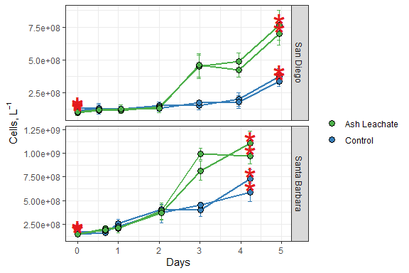
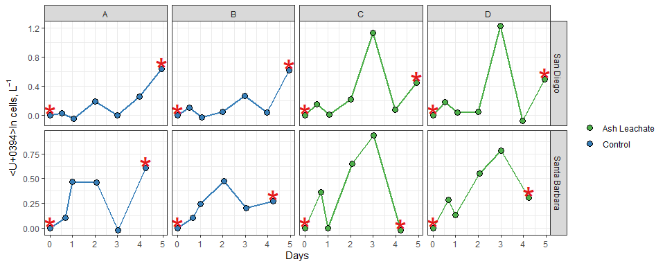
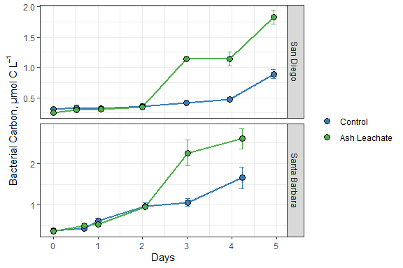
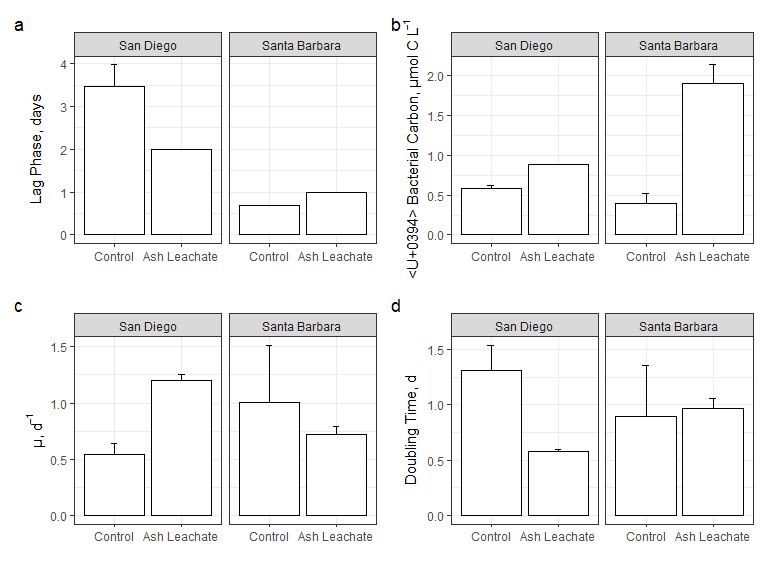

ACIDD Experiment Bacterial Abundance
================
Samantha Chen
11/3/2020

# Intro

This document shows how **individual bottle** bacterial abundance data
from ACIDD experiments were processed, QC’d, and analyzed.

``` r
library(tidyverse)
library(lubridate)
library(readxl)
```

\#Import Data

``` r
excel_sheets("~/GitHub EEMB 144L/144l_students/Input_Data/week3/ACIDD_Exp_BactAbund.xlsx")
```

    ## [1] "Metadata" "Data"

``` r
metadata <- read_excel("~/GitHub EEMB 144L/144l_students/Input_Data/week3/ACIDD_Exp_BactAbund.xlsx", sheet = "Metadata")
glimpse(metadata)
```

    ## Rows: 84
    ## Columns: 18
    ## $ Experiment              <chr> "ASH171", "ASH171", "ASH171", "ASH171", "AS...
    ## $ Location                <chr> "San Diego", "San Diego", "San Diego", "San...
    ## $ Temperature_C           <dbl> 15, 15, 15, 15, 15, 15, 15, 15, 15, 15, 15,...
    ## $ Depth                   <dbl> 5, 5, 5, 5, 5, 5, 5, 5, 5, 5, 5, 5, 5, 5, 5...
    ## $ Bottle                  <chr> "A", "A", "A", "A", "A", "A", "A", "A", "A"...
    ## $ Timepoint               <dbl> 0, 1, 2, 3, 4, 5, 6, 7, 8, 9, 10, 0, 1, 2, ...
    ## $ Treatment               <chr> "Control", "Control", "Control", "Control",...
    ## $ Target_DOC_Amendment_uM <dbl> 0, 0, 0, 0, 0, 0, 0, 0, 0, 0, 0, 0, 0, 0, 0...
    ## $ Inoculum_L              <dbl> 1.5, 1.5, 1.5, 1.5, 1.5, 1.5, 1.5, 1.5, 1.5...
    ## $ Media_L                 <dbl> 4, 4, 4, 4, 4, 4, 4, 4, 4, 4, 4, 4, 4, 4, 4...
    ## $ Datetime                <chr> "2017-12-16T21:30", "2017-12-17T10:00", "20...
    ## $ TOC_Sample              <lgl> TRUE, FALSE, FALSE, FALSE, FALSE, FALSE, FA...
    ## $ DOC_Sample              <lgl> TRUE, TRUE, FALSE, TRUE, FALSE, FALSE, FALS...
    ## $ Parallel_Sample         <lgl> TRUE, FALSE, FALSE, FALSE, FALSE, FALSE, FA...
    ## $ Cell_Sample             <lgl> TRUE, TRUE, TRUE, TRUE, TRUE, TRUE, TRUE, F...
    ## $ DNA_Sample              <lgl> TRUE, FALSE, FALSE, FALSE, FALSE, FALSE, TR...
    ## $ Nutrient_Sample         <lgl> TRUE, FALSE, FALSE, FALSE, FALSE, FALSE, TR...
    ## $ DNA_SampleID            <chr> "ASH171-A0_S293", NA, NA, NA, NA, NA, "ASH1...

``` r
#unique(metadata$Experiment)
#unique(metadata$Location)
#unique(metadata$Bottle)
#unique(metadata$Treatment)

data <- read_excel("~/GitHub EEMB 144L/144l_students/Input_Data/week3/ACIDD_Exp_BactAbund.xlsx", sheet = "Data")
glimpse(data)
```

    ## Rows: 52
    ## Columns: 5
    ## $ Experiment  <chr> "ASH171", "ASH171", "ASH171", "ASH171", "ASH171", "ASH1...
    ## $ Bottle      <chr> "A", "A", "A", "A", "A", "A", "A", "B", "B", "B", "B", ...
    ## $ Timepoint   <dbl> 0, 1, 2, 3, 4, 5, 6, 0, 1, 2, 3, 4, 5, 6, 0, 1, 2, 3, 4...
    ## $ Cells_ml    <dbl> 130000, 134000, 128000, 155000, 155000, 200000, 377000,...
    ## $ Cells_ml_sd <dbl> 20900, 27600, 22200, 25200, 31900, 49100, 59700, 18400,...

``` r
joined <- left_join(metadata, data)
```

    ## Joining, by = c("Experiment", "Bottle", "Timepoint")

``` r
names(joined)
```

    ##  [1] "Experiment"              "Location"               
    ##  [3] "Temperature_C"           "Depth"                  
    ##  [5] "Bottle"                  "Timepoint"              
    ##  [7] "Treatment"               "Target_DOC_Amendment_uM"
    ##  [9] "Inoculum_L"              "Media_L"                
    ## [11] "Datetime"                "TOC_Sample"             
    ## [13] "DOC_Sample"              "Parallel_Sample"        
    ## [15] "Cell_Sample"             "DNA_Sample"             
    ## [17] "Nutrient_Sample"         "DNA_SampleID"           
    ## [19] "Cells_ml"                "Cells_ml_sd"

``` r
#summary(joined)
glimpse(joined)
```

    ## Rows: 84
    ## Columns: 20
    ## $ Experiment              <chr> "ASH171", "ASH171", "ASH171", "ASH171", "AS...
    ## $ Location                <chr> "San Diego", "San Diego", "San Diego", "San...
    ## $ Temperature_C           <dbl> 15, 15, 15, 15, 15, 15, 15, 15, 15, 15, 15,...
    ## $ Depth                   <dbl> 5, 5, 5, 5, 5, 5, 5, 5, 5, 5, 5, 5, 5, 5, 5...
    ## $ Bottle                  <chr> "A", "A", "A", "A", "A", "A", "A", "A", "A"...
    ## $ Timepoint               <dbl> 0, 1, 2, 3, 4, 5, 6, 7, 8, 9, 10, 0, 1, 2, ...
    ## $ Treatment               <chr> "Control", "Control", "Control", "Control",...
    ## $ Target_DOC_Amendment_uM <dbl> 0, 0, 0, 0, 0, 0, 0, 0, 0, 0, 0, 0, 0, 0, 0...
    ## $ Inoculum_L              <dbl> 1.5, 1.5, 1.5, 1.5, 1.5, 1.5, 1.5, 1.5, 1.5...
    ## $ Media_L                 <dbl> 4, 4, 4, 4, 4, 4, 4, 4, 4, 4, 4, 4, 4, 4, 4...
    ## $ Datetime                <chr> "2017-12-16T21:30", "2017-12-17T10:00", "20...
    ## $ TOC_Sample              <lgl> TRUE, FALSE, FALSE, FALSE, FALSE, FALSE, FA...
    ## $ DOC_Sample              <lgl> TRUE, TRUE, FALSE, TRUE, FALSE, FALSE, FALS...
    ## $ Parallel_Sample         <lgl> TRUE, FALSE, FALSE, FALSE, FALSE, FALSE, FA...
    ## $ Cell_Sample             <lgl> TRUE, TRUE, TRUE, TRUE, TRUE, TRUE, TRUE, F...
    ## $ DNA_Sample              <lgl> TRUE, FALSE, FALSE, FALSE, FALSE, FALSE, TR...
    ## $ Nutrient_Sample         <lgl> TRUE, FALSE, FALSE, FALSE, FALSE, FALSE, TR...
    ## $ DNA_SampleID            <chr> "ASH171-A0_S293", NA, NA, NA, NA, NA, "ASH1...
    ## $ Cells_ml                <dbl> 130000, 134000, 128000, 155000, 155000, 200...
    ## $ Cells_ml_sd             <dbl> 20900, 27600, 22200, 25200, 31900, 49100, 5...

# Prepare Data

Convert date and time column values from characters to dates, add
columns with time elapsed for each experiment,convert cells/ml to
cells/L, subset data to select only VOI and drop NA’s

``` r
cells <- joined %>% 
  mutate(Datetime = ymd_hm(Datetime),
         cells = Cells_ml * 1000,
         sd_cells = Cells_ml_sd * 1000) %>% 
  group_by(Experiment, Treatment, Bottle) %>% 
  mutate(interv = interval(first(Datetime), Datetime), 
         hours = interv/3600,
         days = hours/24) %>% 
  ungroup() %>% 
  select(Experiment:Nutrient_Sample, hours, days, cells, sd_cells) %>% 
  drop_na(cells)

glimpse(cells)
```

    ## Rows: 52
    ## Columns: 21
    ## $ Experiment              <chr> "ASH171", "ASH171", "ASH171", "ASH171", "AS...
    ## $ Location                <chr> "San Diego", "San Diego", "San Diego", "San...
    ## $ Temperature_C           <dbl> 15, 15, 15, 15, 15, 15, 15, 15, 15, 15, 15,...
    ## $ Depth                   <dbl> 5, 5, 5, 5, 5, 5, 5, 5, 5, 5, 5, 5, 5, 5, 5...
    ## $ Bottle                  <chr> "A", "A", "A", "A", "A", "A", "A", "B", "B"...
    ## $ Timepoint               <dbl> 0, 1, 2, 3, 4, 5, 6, 0, 1, 2, 3, 4, 5, 6, 0...
    ## $ Treatment               <chr> "Control", "Control", "Control", "Control",...
    ## $ Target_DOC_Amendment_uM <dbl> 0, 0, 0, 0, 0, 0, 0, 0, 0, 0, 0, 0, 0, 0, 1...
    ## $ Inoculum_L              <dbl> 1.5, 1.5, 1.5, 1.5, 1.5, 1.5, 1.5, 1.5, 1.5...
    ## $ Media_L                 <dbl> 4, 4, 4, 4, 4, 4, 4, 4, 4, 4, 4, 4, 4, 4, 4...
    ## $ Datetime                <dttm> 2017-12-16 21:30:00, 2017-12-17 10:00:00, ...
    ## $ TOC_Sample              <lgl> TRUE, FALSE, FALSE, FALSE, FALSE, FALSE, FA...
    ## $ DOC_Sample              <lgl> TRUE, TRUE, FALSE, TRUE, FALSE, FALSE, FALS...
    ## $ Parallel_Sample         <lgl> TRUE, FALSE, FALSE, FALSE, FALSE, FALSE, FA...
    ## $ Cell_Sample             <lgl> TRUE, TRUE, TRUE, TRUE, TRUE, TRUE, TRUE, T...
    ## $ DNA_Sample              <lgl> TRUE, FALSE, FALSE, FALSE, FALSE, FALSE, TR...
    ## $ Nutrient_Sample         <lgl> TRUE, FALSE, FALSE, FALSE, FALSE, FALSE, TR...
    ## $ hours                   <Interval> 2017-12-16 21:30:00 UTC--2017-12-16 21...
    ## $ days                    <Interval> 2017-12-16 21:30:00 UTC--2017-12-16 21...
    ## $ cells                   <dbl> 1.30e+08, 1.34e+08, 1.28e+08, 1.55e+08, 1.5...
    ## $ sd_cells                <dbl> 2.09e+07, 2.76e+07, 2.22e+07, 2.52e+07, 3.1...

\#Plot Growth Curves

``` r
custom.colors <- c("Control" = "#377EB8", "Ash Leachate" = "#4DAF4A", "Santa Barbara" = "#E41A1C", "San Diego" = "#FF7F00")
levels <- c("Control", "Ash Leachate", "San Diego", "Santa Barbara")

cells %>%
  mutate(dna = ifelse(DNA_Sample == T, "*", NA)) %>% 
  ggplot(aes(x = days, y = cells, group = interaction(Experiment, Treatment, Bottle))) +
  geom_errorbar(aes(ymin = cells - sd_cells, ymax = cells + sd_cells, color = factor(Treatment, levels = levels)), width = 0.1) +
  geom_line(aes(color = factor(Treatment, levels = levels)), size = 1) +
  geom_point(aes(fill = Treatment), size = 3, color = "black", shape = 21) +
  geom_text(aes(label = dna), size = 12, color = "#E41A1C") +
  labs(x = "Days", y = expression(paste("Cells, L"^-1)), fill = "") +
  guides(color = F) +
  scale_color_manual(values = custom.colors) +
  scale_fill_manual(values = custom.colors) +
  facet_grid(rows = "Location", scales = "free") +
  theme_bw()
```

<!-- -->

We can calculate:

  - Total change in cells from initial condition to end of experiment
  - Specific growth rates as the slope of ln(abundance) v. time during
    exponential growth phase
  - Doubling time as ln(2) divided by specific growth rate
  - Mean of each of these parameters for each treatment

First we’ll need to determine where exponential growth occurs in each of
the experiments, if it does. So let’s plot ln(abundance) v. time

**NOTE about logarithms in R**

log(x) gives the natural log of x, not log base 10 log10(x) gives the
log base 10 log2(x) gives log base 2

``` r
ln_cells <- cells %>% 
  group_by(Experiment, Treatment, Bottle) %>% 
  mutate(ln_cells = log(cells),
         diff_ln_cells = ln_cells - lag(ln_cells, default = first(ln_cells))) %>% 
  ungroup()

ln_cells %>%
  mutate(dna = ifelse(DNA_Sample == T, "*", NA)) %>% 
  ggplot(aes(x = days, y = diff_ln_cells, group = interaction(Experiment, Treatment, Bottle))) +
  geom_line(aes(color = factor(Treatment, levels = levels)), size = 1) +
  geom_point(aes(fill = Treatment), size = 3, color = "black", shape = 21) +
  geom_text(aes(label = dna), size = 12, color = "#E41A1C") +
  labs(x = "Days", y = expression(paste("Δln cells, L"^-1)), fill = "") +
  guides(color = F) +
  scale_color_manual(values = custom.colors) +
  scale_fill_manual(values = custom.colors) +
  facet_grid(Location~Bottle, scales = "free") +
  theme_bw()
```

<!-- --> This
plot makes it a little easier to see, with the data that we have, where
exponential growth occurs for each bottle:

  - SD Bottle A \~3-5 d (T4-T6)

  - SD Bottle B \~4-5 d (T5-T6)

  - SD Bottle C \~2-3 d (T3-T4)

  - SD Bottle D \~2-3 d (T3-T4)

  - SB Bottle A \~0.5-1 d (T1-T2)

  - SB Bottle B \~0.5-2 d (T1-T3)

  - SB Bottle C \~1-3 d (T2-T4)

  - SB Bottle D \~1-3 d (T2-T4)

# Calculate growth rates, doubling time, and Delta cell abd

``` r
growth <- ln_cells %>% 
  mutate(exp_start = ifelse(Experiment == "ASH171" & Bottle == "A", 4, NA),
         exp_start = ifelse(Experiment == "ASH171" & Bottle == "B", 5, exp_start),
         exp_start = ifelse(Experiment == "ASH171" & Bottle %in% c("C", "D"), 3,exp_start),
         exp_start = ifelse(Experiment == "ASH172" & Bottle %in% c("A", "B"), 1, exp_start),
         exp_start = ifelse(Experiment == "ASH172" & Bottle %in% c("C", "D"), 2, exp_start),
         
         exp_end = ifelse(Experiment == "ASH171" & Bottle %in% c("A", "B"), 6, 4),
         exp_end = ifelse(Experiment == "ASH172" & Bottle == "A",2, exp_end),
         exp_end = ifelse(Experiment == "ASH172" & Bottle == "B", 3, exp_end)) %>% 
  group_by(Experiment, Treatment, Bottle) %>% 
  mutate(ln_cells_exp_start = ifelse(Timepoint == exp_start, ln_cells, NA),
         ln_cells_exp_end = ifelse(Timepoint == exp_end, ln_cells, NA),
         cells_exp_start = ifelse(Timepoint == exp_start, cells, NA),
         cells_exp_end = ifelse(Timepoint == exp_end, cells, NA),
         days_exp_start = ifelse(Timepoint == exp_start, days, NA),
         days_exp_end = ifelse(Timepoint == exp_end, days, NA)) %>% 
  fill(ln_cells_exp_start:days_exp_end, .direction = "updown") %>% 
  mutate(mew = (ln_cells_exp_end - ln_cells_exp_start)/(days_exp_end - days_exp_start),
         doubling = log(2)/mew,
         delta_cells = cells_exp_end - first(cells)) %>% 
  ungroup()
```

# Convert bacterial abundance and change in bacterial abundance to carbon units

Apply a carbon conversion factor(CCF) to bacterial abundance (cells
L^-1) to generate bacterial carbon(micromol carbon L^-1)

We’ll apply the average carbon content of bacterioplankton cells from
Coastal Japan (\~30 fg C cell^-1) reported by [Fukuda et
al., 1998](https://aem.asm.org/content/64/9/3352)

``` r
bactcarbon <- growth %>% 
  mutate(bc = cells * (2.5 * 10^-9),
         delta_bc = delta_cells * (2.5 * 10^-9))

glimpse(bactcarbon)
```

    ## Rows: 52
    ## Columns: 36
    ## $ Experiment              <chr> "ASH171", "ASH171", "ASH171", "ASH171", "AS...
    ## $ Location                <chr> "San Diego", "San Diego", "San Diego", "San...
    ## $ Temperature_C           <dbl> 15, 15, 15, 15, 15, 15, 15, 15, 15, 15, 15,...
    ## $ Depth                   <dbl> 5, 5, 5, 5, 5, 5, 5, 5, 5, 5, 5, 5, 5, 5, 5...
    ## $ Bottle                  <chr> "A", "A", "A", "A", "A", "A", "A", "B", "B"...
    ## $ Timepoint               <dbl> 0, 1, 2, 3, 4, 5, 6, 0, 1, 2, 3, 4, 5, 6, 0...
    ## $ Treatment               <chr> "Control", "Control", "Control", "Control",...
    ## $ Target_DOC_Amendment_uM <dbl> 0, 0, 0, 0, 0, 0, 0, 0, 0, 0, 0, 0, 0, 0, 1...
    ## $ Inoculum_L              <dbl> 1.5, 1.5, 1.5, 1.5, 1.5, 1.5, 1.5, 1.5, 1.5...
    ## $ Media_L                 <dbl> 4, 4, 4, 4, 4, 4, 4, 4, 4, 4, 4, 4, 4, 4, 4...
    ## $ Datetime                <dttm> 2017-12-16 21:30:00, 2017-12-17 10:00:00, ...
    ## $ TOC_Sample              <lgl> TRUE, FALSE, FALSE, FALSE, FALSE, FALSE, FA...
    ## $ DOC_Sample              <lgl> TRUE, TRUE, FALSE, TRUE, FALSE, FALSE, FALS...
    ## $ Parallel_Sample         <lgl> TRUE, FALSE, FALSE, FALSE, FALSE, FALSE, FA...
    ## $ Cell_Sample             <lgl> TRUE, TRUE, TRUE, TRUE, TRUE, TRUE, TRUE, T...
    ## $ DNA_Sample              <lgl> TRUE, FALSE, FALSE, FALSE, FALSE, FALSE, TR...
    ## $ Nutrient_Sample         <lgl> TRUE, FALSE, FALSE, FALSE, FALSE, FALSE, TR...
    ## $ hours                   <Interval> 2017-12-16 21:30:00 UTC--2017-12-16 21...
    ## $ days                    <Interval> 2017-12-16 21:30:00 UTC--2017-12-16 21...
    ## $ cells                   <dbl> 1.30e+08, 1.34e+08, 1.28e+08, 1.55e+08, 1.5...
    ## $ sd_cells                <dbl> 2.09e+07, 2.76e+07, 2.22e+07, 2.52e+07, 3.1...
    ## $ ln_cells                <dbl> 18.68305, 18.71335, 18.66754, 18.85894, 18....
    ## $ diff_ln_cells           <dbl> 0.000000000, 0.030305349, -0.045809536, 0.1...
    ## $ exp_start               <dbl> 4, 4, 4, 4, 4, 4, 4, 5, 5, 5, 5, 5, 5, 5, 3...
    ## $ exp_end                 <dbl> 6, 6, 6, 6, 6, 6, 6, 6, 6, 6, 6, 6, 6, 6, 4...
    ## $ ln_cells_exp_start      <dbl> 18.85894, 18.85894, 18.85894, 18.85894, 18....
    ## $ ln_cells_exp_end        <dbl> 19.74776, 19.74776, 19.74776, 19.74776, 19....
    ## $ cells_exp_start         <dbl> 1.55e+08, 1.55e+08, 1.55e+08, 1.55e+08, 1.5...
    ## $ cells_exp_end           <dbl> 3.77e+08, 3.77e+08, 3.77e+08, 3.77e+08, 3.7...
    ## $ days_exp_start          <dbl> 2.979167, 2.979167, 2.979167, 2.979167, 2.9...
    ## $ days_exp_end            <dbl> 4.937500, 4.937500, 4.937500, 4.937500, 4.9...
    ## $ mew                     <dbl> 0.4538656, 0.4538656, 0.4538656, 0.4538656,...
    ## $ doubling                <dbl> 1.5272081, 1.5272081, 1.5272081, 1.5272081,...
    ## $ delta_cells             <dbl> 247000000, 247000000, 247000000, 247000000,...
    ## $ bc                      <dbl> 0.32500, 0.33500, 0.32000, 0.38750, 0.38750...
    ## $ delta_bc                <dbl> 0.61750, 0.61750, 0.61750, 0.61750, 0.61750...

# Calculate treatment averages

``` r
averages <- bactcarbon %>% 
  group_by(Experiment, Treatment, Timepoint) %>% 
  mutate(ave_bc = mean(bc),
         sd_bc = sd(bc))
subset <- averages %>% 
  ungroup() %>% 
  group_by(Experiment, Treatment) %>% 
  mutate(ave_mew = mean(mew),
         sd_mew = sd(mew),
         ave_doubling = mean(doubling),
         sd_doubling = sd(doubling),
         ave_delta_cells = mean(delta_cells),
         sd_delta_cells = sd(delta_cells),
         ave_delta_bc = mean(delta_bc),
         sd_delta_bc = sd(delta_bc),
         ave_lag = mean(days_exp_start),
         sd_lag = sd(days_exp_start)) %>% 
  ungroup()
  
glimpse(averages)
```

    ## Rows: 52
    ## Columns: 38
    ## Groups: Experiment, Treatment, Timepoint [26]
    ## $ Experiment              <chr> "ASH171", "ASH171", "ASH171", "ASH171", "AS...
    ## $ Location                <chr> "San Diego", "San Diego", "San Diego", "San...
    ## $ Temperature_C           <dbl> 15, 15, 15, 15, 15, 15, 15, 15, 15, 15, 15,...
    ## $ Depth                   <dbl> 5, 5, 5, 5, 5, 5, 5, 5, 5, 5, 5, 5, 5, 5, 5...
    ## $ Bottle                  <chr> "A", "A", "A", "A", "A", "A", "A", "B", "B"...
    ## $ Timepoint               <dbl> 0, 1, 2, 3, 4, 5, 6, 0, 1, 2, 3, 4, 5, 6, 0...
    ## $ Treatment               <chr> "Control", "Control", "Control", "Control",...
    ## $ Target_DOC_Amendment_uM <dbl> 0, 0, 0, 0, 0, 0, 0, 0, 0, 0, 0, 0, 0, 0, 1...
    ## $ Inoculum_L              <dbl> 1.5, 1.5, 1.5, 1.5, 1.5, 1.5, 1.5, 1.5, 1.5...
    ## $ Media_L                 <dbl> 4, 4, 4, 4, 4, 4, 4, 4, 4, 4, 4, 4, 4, 4, 4...
    ## $ Datetime                <dttm> 2017-12-16 21:30:00, 2017-12-17 10:00:00, ...
    ## $ TOC_Sample              <lgl> TRUE, FALSE, FALSE, FALSE, FALSE, FALSE, FA...
    ## $ DOC_Sample              <lgl> TRUE, TRUE, FALSE, TRUE, FALSE, FALSE, FALS...
    ## $ Parallel_Sample         <lgl> TRUE, FALSE, FALSE, FALSE, FALSE, FALSE, FA...
    ## $ Cell_Sample             <lgl> TRUE, TRUE, TRUE, TRUE, TRUE, TRUE, TRUE, T...
    ## $ DNA_Sample              <lgl> TRUE, FALSE, FALSE, FALSE, FALSE, FALSE, TR...
    ## $ Nutrient_Sample         <lgl> TRUE, FALSE, FALSE, FALSE, FALSE, FALSE, TR...
    ## $ hours                   <Interval> 2017-12-16 21:30:00 UTC--2017-12-16 21...
    ## $ days                    <Interval> 2017-12-16 21:30:00 UTC--2017-12-16 21...
    ## $ cells                   <dbl> 1.30e+08, 1.34e+08, 1.28e+08, 1.55e+08, 1.5...
    ## $ sd_cells                <dbl> 2.09e+07, 2.76e+07, 2.22e+07, 2.52e+07, 3.1...
    ## $ ln_cells                <dbl> 18.68305, 18.71335, 18.66754, 18.85894, 18....
    ## $ diff_ln_cells           <dbl> 0.000000000, 0.030305349, -0.045809536, 0.1...
    ## $ exp_start               <dbl> 4, 4, 4, 4, 4, 4, 4, 5, 5, 5, 5, 5, 5, 5, 3...
    ## $ exp_end                 <dbl> 6, 6, 6, 6, 6, 6, 6, 6, 6, 6, 6, 6, 6, 6, 4...
    ## $ ln_cells_exp_start      <dbl> 18.85894, 18.85894, 18.85894, 18.85894, 18....
    ## $ ln_cells_exp_end        <dbl> 19.74776, 19.74776, 19.74776, 19.74776, 19....
    ## $ cells_exp_start         <dbl> 1.55e+08, 1.55e+08, 1.55e+08, 1.55e+08, 1.5...
    ## $ cells_exp_end           <dbl> 3.77e+08, 3.77e+08, 3.77e+08, 3.77e+08, 3.7...
    ## $ days_exp_start          <dbl> 2.979167, 2.979167, 2.979167, 2.979167, 2.9...
    ## $ days_exp_end            <dbl> 4.937500, 4.937500, 4.937500, 4.937500, 4.9...
    ## $ mew                     <dbl> 0.4538656, 0.4538656, 0.4538656, 0.4538656,...
    ## $ doubling                <dbl> 1.5272081, 1.5272081, 1.5272081, 1.5272081,...
    ## $ delta_cells             <dbl> 247000000, 247000000, 247000000, 247000000,...
    ## $ bc                      <dbl> 0.32500, 0.33500, 0.32000, 0.38750, 0.38750...
    ## $ delta_bc                <dbl> 0.61750, 0.61750, 0.61750, 0.61750, 0.61750...
    ## $ ave_bc                  <dbl> 0.308750, 0.330000, 0.317500, 0.358750, 0.4...
    ## $ sd_bc                   <dbl> 0.022980970, 0.007071068, 0.003535534, 0.04...

# Plot treatment averages

``` r
averages %>% 
  ggplot(aes(x = days, y =ave_bc), group = interaction(Experiment, Treatment)) +
  geom_errorbar(aes(ymin = ave_bc - sd_bc, ymax = ave_bc +sd_bc, color = factor(Treatment, levels = levels)), width = 0.1) +
  geom_line(aes(color = factor(Treatment, levels = levels)), size = 1) +
  geom_point(aes(fill = factor(Treatment, levels = levels)), color = "black", shape = 21, size = 3) +
  facet_grid(rows = "Location", scales = "free") +
  scale_color_manual(values = custom.colors) +
  scale_fill_manual(values = custom.colors) +
  labs(x = "Days", y = expression("Bacterial Carbon, µmol C L"^-1), fill = "", color = "") +
  guides(color = F) +
  theme_bw()
```

<!-- -->

### Barplots

``` r
bar.data <- subset %>% 
  select(Location, Treatment, ave_mew:sd_lag) %>% 
  distinct()
```

``` r
mew <- bar.data %>% 
  ggplot(aes(x = factor(Treatment, levels = levels), y = ave_mew), group = interaction(Location, Treatment)) +
  geom_errorbar(aes(ymin = ave_mew - sd_mew, ymax = ave_mew + sd_mew), width = 0.1) +
  geom_col(color = "black", fill = "white") +
  facet_grid(~factor(Location, levels = levels), scales = "free") +
  labs(x = "", y = expression("μ, d"^-1)) +
  theme_bw()
```

``` r
doubling <- bar.data %>% 
  ggplot(aes(x = factor(Treatment, levels = levels), y = ave_doubling), group = interaction(Location, Treatment)) +
  geom_errorbar(aes(ymin = ave_doubling - sd_doubling, ymax = ave_doubling + sd_doubling), width = 0.1) +
  geom_col(color = "black", fill = "white") +
  facet_grid(~factor(Location, levels = levels), scales = "free") +
  labs(x = "", y = expression("Doubling Time, d")) +
  theme_bw()
```

``` r
delta_bc <- bar.data %>% 
  ggplot(aes(x = factor(Treatment, levels = levels), y = ave_delta_bc), group = interaction(Location, Treatment)) +
  geom_errorbar(aes(ymin = ave_delta_bc - sd_delta_bc, ymax = ave_delta_bc + sd_delta_bc), width = 0.1) +
  geom_col(color = "black", fill = "white") +
  facet_grid(~factor(Location, levels = levels), scales = "free") +
  labs(x = "", y = expression("Δ Bacterial Carbon, μmol C L"^-1)) +
  theme_bw()
```

``` r
lag <- bar.data %>% 
  ggplot(aes(x = factor(Treatment, levels = levels), y = ave_lag), group = interaction(Location, Treatment)) +
  geom_errorbar(aes(ymin = ave_lag - sd_lag, ymax = ave_lag + sd_lag), width = 0.1) +
  geom_col(color = "black", fill = "white") +
  facet_grid(~factor(Location, levels = levels), scales = "free") +
  labs(x = "", y = "Lag Phase, days") +
  theme_bw()
```

``` r
#install.packages("patchwork")
library(patchwork)
```

``` r
lag + delta_bc + mew + doubling + plot_annotation(tag_levels = "a")
```

<!-- -->

# Save Data

``` r
saveRDS(averages, "~/GitHub EEMB 144L/144l_students/Output_Data/ACIDD_exp_Processed_BactAbund.rds")
```
