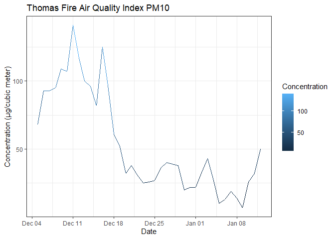
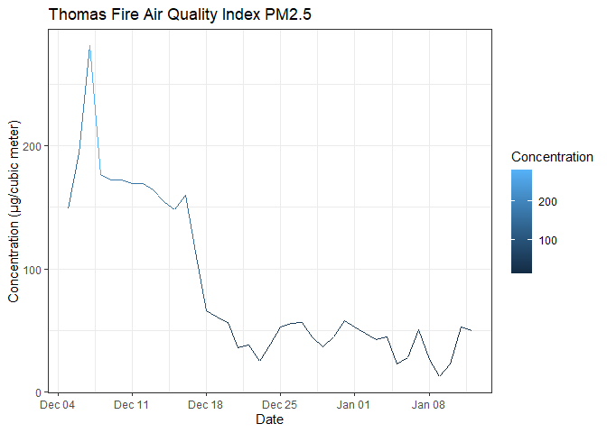

Thomas Fire Progression Assignment
================
Samantha Chen
10/28/2020

For this assignment I will be analyzing data collected during the Thomas
Fire.

# **Data/Data Table**

``` r
library(tidyverse)
```

    ## -- Attaching packages ----------------------------------------------------------- tidyverse 1.3.0 --

    ## v ggplot2 3.3.2     v purrr   0.3.4
    ## v tibble  3.0.3     v dplyr   1.0.2
    ## v tidyr   1.1.2     v stringr 1.4.0
    ## v readr   1.3.1     v forcats 0.5.0

    ## -- Conflicts -------------------------------------------------------------- tidyverse_conflicts() --
    ## x dplyr::filter() masks stats::filter()
    ## x dplyr::lag()    masks stats::lag()

``` r
library(readxl)
excel_sheets("~/GitHub EEMB 144L/144l_students/Input_Data/week1/Thomas_Fire_Progression.xlsx") 
```

    ## [1] "Data"     "Metadata"

``` r
thomasfire.data <- read_excel("~/GitHub EEMB 144L/144l_students/Input_Data/week1/Thomas_Fire_Progression.xlsx") #can't knit read_excel


glimpse(thomasfire.data)
```

    ## Rows: 39
    ## Columns: 5
    ## $ Date         <dttm> 2017-12-05, 2017-12-06, 2017-12-07, 2017-12-08, 2017-...
    ## $ Acres_Burned <dbl> 50000, 90000, 115000, 143000, 155000, 230000, 231700, ...
    ## $ Containment  <dbl> 0, 5, 5, 10, 15, 10, 20, 25, 30, 35, 35, 40, 45, 50, 5...
    ## $ PM10         <dbl> 68, 93, NA, 95, 109, 107, 141, 117, 100, 96, 82, 125, ...
    ## $ PM25         <dbl> 149, 194, 281, 177, 172, 172, 169, 169, 164, 155, 148,...

Looking at the data, I will be creating two plots that looks at air
quality of both PM10 and PM2.5 over the course of the Thomas Fire.

``` r
PM10.data <- thomasfire.data %>% 
  select(Date, PM10) %>% 
  mutate_at(vars(PM10), replace_na, 93) %>% 
  rename(Concentration = PM10)
PM25.data <- thomasfire.data %>% 
  select(Date, PM25) %>% 
  rename(Concentration = PM25) #how to add units?
```

# **Graphs**

*Thomas Fire Air Quality Index PM10*

``` r
ggplot(PM10.data, aes(x = Date, y = Concentration)) + 
  geom_line(aes(color = Concentration)) +
  labs(title = "Thomas Fire Air Quality Index PM10", y = "Concentration (µg/cubic meter)") +
  theme_bw()
```

<!-- -->

From this graph, I can see that the concentration of particulate matter
that were 10 micrometers (and smaller) decreased over time. This is most
likely due to the fact that over time, the fire was slowly contained and
put out, so less ash was present in the air. What is interesting is how
the concentration fluctuates up and down instead of following a general
downhill trend.

*Thomas Fire Air Quality Index PM2.5*

``` r
ggplot(PM25.data, aes(x = Date, y = Concentration)) + 
  geom_line(aes(color = Concentration)) +
  labs(title = "Thomas Fire Air Quality Index PM2.5", y = "Concentration (µg/cubic meter)") +
  theme_bw()
```

<!-- -->

From this graph, the first thing I noticed was the much higher peak that
surpasses 200 µg/cubic meter indicating a higher concentration of PM2.5
than PM10. This tells me that in a non-contained fire a much higher
concentration of PM2.5 is released into the air, which can be a health
hazard. Fortunately, this graph also shows a decrease in concentration
over time, and, unlike PM10, its concentration drops much more
dramatically.
