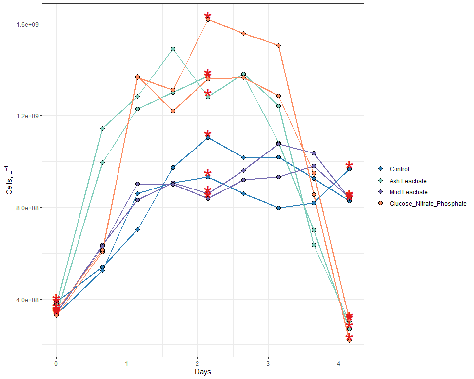
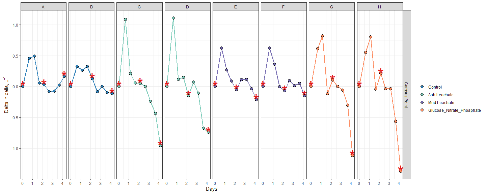
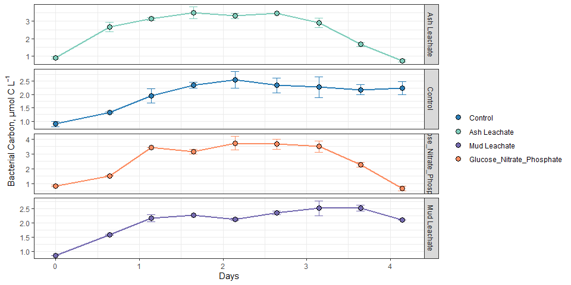
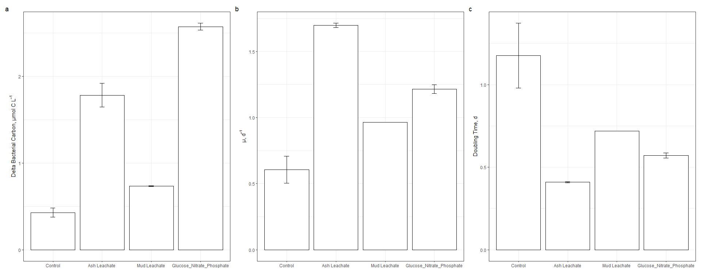

EEMB 144L 2018 Bacterial Abundance
================
Samantha Chen
11/4/2020

# Intro

In this assignment, I will be showing how **individual bottle**
bacterial abundance data from EEMB 144L experiments were processed,
QC’d, and analyzed.

``` r
library(tidyverse)
library(lubridate)
library(readxl)

excel_sheets("~/GitHub EEMB 144L/144l_students/Input_Data/week3/144L_2018_BactAbund.xlsx")
```

    ## [1] "Metadata" "Data"

``` r
metadata2018 <- read_excel("~/GitHub EEMB 144L/144l_students/Input_Data/week3/144L_2018_BactAbund.xlsx", sheet = "Metadata")
data2018 <- read_excel("~/GitHub EEMB 144L/144l_students/Input_Data/week3/144L_2018_BactAbund.xlsx", sheet = "Data")
```

``` r
joined2018 <- left_join(metadata2018, data2018)
```

    ## Joining, by = c("Bottle", "Timepoint")

# Preparing Data

``` r
cells2018 <- joined2018 %>% 
  mutate(Datetime = ymd_hm(Datetime),
         cells = Cells_ml * 1000) %>% 
  group_by(Experiment, Treatment, Bottle) %>% 
  mutate(interv = interval(first(Datetime), Datetime),
         hours = interv/3600,
         days = hours/24) %>%
  ungroup() %>% 
  select(Experiment:DNA_Sample, hours, days, cells) %>%
  drop_na(cells)
```

# Growth Curves

``` r
custom.colors <- c("Control" = "#2c7fb8", "Ash Leachate" = "#7fcdbb", "Mud Leachate" = "#756bb1", "Glucose_Nitrate_Phosphate" = "#fc8d62")
levels <- c("Control", "Ash Leachate", "Mud Leachate", "Glucose_Nitrate_Phosphate")

cells2018 %>% 
  mutate(dna = ifelse(DNA_Sample == T, "*", NA)) %>% 
  ggplot(aes(x = days, y = cells, group = interaction(Treatment, Bottle))) +
  geom_line(aes(color = factor(Treatment, levels = levels)), size = 1) +
  geom_point(aes(fill = factor(Treatment, levels = levels)), size = 3, color = "black", shape = 21) +
  geom_text(aes(label = dna), size = 12,  color = "#E41A1C") +
  labs(x = "Days", y = expression(paste("Cells, L"^-1)), fill = "") +
  guides(color = F) +
  scale_color_manual(values = custom.colors) +
  scale_fill_manual(values = custom.colors) +
  #facet_grid(rows = "Treatment", scales = "free") +
  theme_bw() 
```

    ## Warning: Removed 48 rows containing missing values (geom_text).

<!-- -->
Looking at the growth curves, I can see that both the ash and mud
leachate stimulates growth similar to that of the
Glucose+Nitrate+Phosphorus. What is interesting is that while the ash
leachate and GNP abundance crashed on day 4, the mud leachate did not
crash, but does show signs of decline.

# Exponential Growth Curves

``` r
ln_cells2018 <- cells2018 %>% 
  group_by(Treatment, Bottle) %>% 
  mutate(ln_cells = log(cells),
         diff_ln_cells = ln_cells - lag(ln_cells, default = first(ln_cells))) %>% 
  ungroup()
```

``` r
ln_cells2018 %>% 
  mutate(dna = ifelse(DNA_Sample == T, "*", NA)) %>% 
  ggplot(aes(x = days, y = diff_ln_cells, group = interaction(Treatment, Bottle))) +
  geom_line(aes(color = factor(Treatment, levels = levels)), size = 1) +
  geom_point(aes(fill = factor(Treatment, levels = levels)), size = 3, color = "black", shape = 21) +
  geom_text(aes(label = dna), size = 12,  color = "#E41A1C") +
  labs(x = "Days", y = expression(paste("Delta ln cells, L"^-1)), fill = "") +
  guides(color = F) +
  scale_color_manual(values = custom.colors) +
  scale_fill_manual(values = custom.colors) +
  facet_grid(Location~Bottle, scales = "free", drop = F) +
  theme_bw()
```

<!-- -->

*Exponential Growth Occurrence*

  - Control Bottle A \~0-1 d (T0-T1)
  - Control Bottle B \~0-1 d (T0-T1)
  - Ash Leachate Bottle C \~0-0.5 d (T0-T1)
  - Ash Leachate Bottle D \~0-0.5 d (T0-T1)
  - Mud Leachate Bottle E \~0-0.5 d (T0-T1)
  - Mud Leachate Bottle F \~0-0.5 d (T0-T1)
  - G+N+P Bottle G \~0-1 d (T1-T2)
  - G+N+P Bottle H \~0-1 d (T1-T2)

All bottles showed exponential growth from day 0 to day 1.

# Growth rates, doubling times, and ∆cell abundances

``` r
growth2018 <- ln_cells2018 %>% 
  mutate(start_exp = 0,
         end_exp = ifelse(Bottle %in% c("G", "H"), 2, 1)) %>% 
  group_by(Treatment, Bottle) %>% 
  mutate(ln_cells_start_exp = ifelse(Timepoint == start_exp, ln_cells, NA),
         ln_cells_end_exp = ifelse(Timepoint == end_exp, ln_cells, NA), 
         cells_start_exp = ifelse(Timepoint == start_exp, cells, NA), 
         cells_end_exp = ifelse(Timepoint == end_exp, cells, NA), 
         days_start_exp = ifelse(Timepoint == start_exp, days, NA), 
         days_end_exp = ifelse(Timepoint == end_exp, days, NA)) %>% 
  fill(ln_cells_start_exp:days_end_exp, .direction = "updown") %>% 
  mutate(mew = (ln_cells_end_exp - ln_cells_start_exp)/(days_end_exp - days_start_exp), 
         doubling = log(2)/mew,
         delta_cells = cells_end_exp - first(cells)) %>% 
  ungroup()
```

# Bacterial Abundance & Change in Bacterial Abundance –\> Carbon Units

``` r
bactcarbon2018 <- growth2018 %>% 
  mutate(bc = cells * (2.5 * 10^-9), 
         delta_bc = delta_cells * (2.5 * 10^-9))
```

# Treatment Averages

``` r
averages2018 <- bactcarbon2018 %>%
  group_by(Treatment, Timepoint) %>% 
  mutate(ave_bc = mean(bc),
         sd_bc = sd(bc)) %>% 
  ungroup() %>% 
  group_by(Treatment) %>% 
  mutate(ave_mew = mean(mew),
         sd_mew = sd(mew),
         ave_doubling = mean(doubling),
         sd_doubling = sd(doubling),
         ave_delta_cells = mean(delta_cells),
         sd_delta_cells = sd(delta_cells),
         ave_delta_bc = mean(delta_bc),
         sd_delta_bc = sd(delta_bc),
         ave_lag = mean(days_start_exp),
         sd_lag = sd(days_start_exp)) %>% 
  ungroup()
  
glimpse(averages2018) 
```

    ## Rows: 72
    ## Columns: 45
    ## $ Experiment           <chr> "144L_2018", "144L_2018", "144L_2018", "144L_2...
    ## $ Location             <chr> "Campus Point", "Campus Point", "Campus Point"...
    ## $ Temperature          <dbl> 20, 20, 20, 20, 20, 20, 20, 20, 20, 20, 20, 20...
    ## $ Depth                <dbl> 1, 1, 1, 1, 1, 1, 1, 1, 1, 1, 1, 1, 1, 1, 1, 1...
    ## $ Bottle               <chr> "A", "A", "A", "A", "A", "A", "A", "A", "A", "...
    ## $ Timepoint            <dbl> 0, 1, 2, 3, 4, 5, 6, 7, 8, 0, 1, 2, 3, 4, 5, 6...
    ## $ Treatment            <chr> "Control", "Control", "Control", "Control", "C...
    ## $ Target_DOC_Amendment <dbl> 0, 0, 0, 0, 0, 0, 0, 0, 0, 0, 0, 0, 0, 0, 0, 0...
    ## $ Inoculum_L           <dbl> 1.5, 1.5, 1.5, 1.5, 1.5, 1.5, 1.5, 1.5, 1.5, 1...
    ## $ Media_L              <dbl> 3.5, 3.5, 3.5, 3.5, 3.5, 3.5, 3.5, 3.5, 3.5, 3...
    ## $ Datetime             <dttm> 2018-10-15 16:30:00, 2018-10-16 08:00:00, 201...
    ## $ TOC_Sample           <lgl> TRUE, FALSE, FALSE, FALSE, TRUE, FALSE, FALSE,...
    ## $ Parallel_Sample      <lgl> TRUE, FALSE, FALSE, FALSE, TRUE, FALSE, FALSE,...
    ## $ Cell_Sample          <lgl> TRUE, TRUE, TRUE, TRUE, TRUE, TRUE, TRUE, TRUE...
    ## $ DNA_Sample           <lgl> TRUE, FALSE, FALSE, FALSE, TRUE, FALSE, FALSE,...
    ## $ hours                <Interval> 2018-10-15 16:30:00 UTC--2018-10-15 16:30...
    ## $ days                 <Interval> 2018-10-15 16:30:00 UTC--2018-10-15 16:30...
    ## $ cells                <dbl> 332531522, 523943125, 859019934, 906998856, 93...
    ## $ ln_cells             <dbl> 19.62225, 20.07689, 20.57130, 20.62565, 20.653...
    ## $ diff_ln_cells        <dbl> 0.000000000, 0.454648479, 0.494408990, 0.05434...
    ## $ start_exp            <dbl> 0, 0, 0, 0, 0, 0, 0, 0, 0, 0, 0, 0, 0, 0, 0, 0...
    ## $ end_exp              <dbl> 1, 1, 1, 1, 1, 1, 1, 1, 1, 1, 1, 1, 1, 1, 1, 1...
    ## $ ln_cells_start_exp   <dbl> 19.62225, 19.62225, 19.62225, 19.62225, 19.622...
    ## $ ln_cells_end_exp     <dbl> 20.07689, 20.07689, 20.07689, 20.07689, 20.076...
    ## $ cells_start_exp      <dbl> 332531522, 332531522, 332531522, 332531522, 33...
    ## $ cells_end_exp        <dbl> 523943125, 523943125, 523943125, 523943125, 52...
    ## $ days_start_exp       <dbl> 0, 0, 0, 0, 0, 0, 0, 0, 0, 0, 0, 0, 0, 0, 0, 0...
    ## $ days_end_exp         <dbl> 0.6458333, 0.6458333, 0.6458333, 0.6458333, 0....
    ## $ mew                  <dbl> 0.7039718, 0.7039718, 0.7039718, 0.7039718, 0....
    ## $ doubling             <dbl> 0.9846235, 0.9846235, 0.9846235, 0.9846235, 0....
    ## $ delta_cells          <dbl> 191411603, 191411603, 191411603, 191411603, 19...
    ## $ bc                   <dbl> 0.8313288, 1.3098578, 2.1475498, 2.2674971, 2....
    ## $ delta_bc             <dbl> 0.4785290, 0.4785290, 0.4785290, 0.4785290, 0....
    ## $ ave_bc               <dbl> 0.9022187, 1.3301541, 1.9535757, 2.3515191, 2....
    ## $ sd_bc                <dbl> 0.10025342, 0.02870334, 0.27432087, 0.11882499...
    ## $ ave_mew              <dbl> 0.6056875, 0.6056875, 0.6056875, 0.6056875, 0....
    ## $ sd_mew               <dbl> 0.10113376, 0.10113376, 0.10113376, 0.10113376...
    ## $ ave_doubling         <dbl> 1.1753457, 1.1753457, 1.1753457, 1.1753457, 1....
    ## $ sd_doubling          <dbl> 0.196251588, 0.196251588, 0.196251588, 0.19625...
    ## $ ave_delta_cells      <dbl> 171174186, 171174186, 171174186, 171174186, 17...
    ## $ sd_delta_cells       <dbl> 20824130, 20824130, 20824130, 20824130, 208241...
    ## $ ave_delta_bc         <dbl> 0.4279355, 0.4279355, 0.4279355, 0.4279355, 0....
    ## $ sd_delta_bc          <dbl> 0.05206033, 0.05206033, 0.05206033, 0.05206033...
    ## $ ave_lag              <dbl> 0, 0, 0, 0, 0, 0, 0, 0, 0, 0, 0, 0, 0, 0, 0, 0...
    ## $ sd_lag               <dbl> 0, 0, 0, 0, 0, 0, 0, 0, 0, 0, 0, 0, 0, 0, 0, 0...

# Treatment Average Plots

``` r
averages2018 %>% 
  ggplot(aes(x = days, y = ave_bc), group = interaction(Experiment, Treatment)) +
  geom_errorbar(aes(ymin = ave_bc - sd_bc, ymax = ave_bc + sd_bc, color = factor(Treatment, levels = levels)), width = 0.1) +
  geom_line(aes(color = factor(Treatment, levels = levels)), size = 1) +
  geom_point(aes(fill = factor(Treatment, levels = levels)), color = "black", shape = 21, size = 3) +
  facet_grid(rows = "Treatment", scales = "free") +
  scale_color_manual(values = custom.colors) +
  scale_fill_manual(values = custom.colors) +
  labs(x = "Days", y = expression("Bacterial Carbon, µmol C L"^-1), fill = "", color = "") +
  guides(color = F) +
  theme_bw()
```

<!-- -->
Looking at this graph, I can see that Ash Leachate’s bacterial carbon
curve is very similar to that of GNP’s (except for the slight lag
between day 0-1). In addition, both the GNP and Ash bacterial carbon
abundance decline rapidly between day 3-4, while Mud and control has
stayed relatively constant.

# Barplots

``` r
bar.data2018 <- averages2018 %>% 
  select(Treatment, ave_mew:sd_lag) %>% 
  distinct()
```

``` r
mew2018 <- bar.data2018 %>% 
  ggplot(aes(x = factor(Treatment, levels = levels), y = ave_mew), group = Treatment) +
  geom_col(color = "black", fill = "white") +
  geom_errorbar(aes(ymin = ave_mew - sd_mew, ymax = ave_mew + sd_mew), width = 0.1) +
  labs(x = "", y = expression("µ, d"^-1)) +
  theme_bw()
```

``` r
doubling2018 <- bar.data2018 %>% 
  ggplot(aes(x = factor(Treatment, levels = levels), y = ave_doubling), group = Treatment) +
  geom_col(color = "black", fill = "white") +
  geom_errorbar(aes(ymin = ave_doubling - sd_doubling, ymax = ave_doubling + sd_doubling), width = 0.1) +
  labs(x = "", y = expression("Doubling Time, d")) +
  theme_bw()
```

``` r
delta_bc2018 <- bar.data2018 %>% 
  ggplot(aes(x = factor(Treatment, levels = levels), y = ave_delta_bc), group = Treatment) +
  geom_col(color = "black", fill = "white") +
  geom_errorbar(aes(ymin = ave_delta_bc - sd_delta_bc, ymax = ave_delta_bc + sd_delta_bc), width = 0.1) +
  labs(x = "", y = expression("Delta Bacterial Carbon, µmol C L"^-1)) +
  theme_bw()

library(patchwork)
```

    ## Warning: package 'patchwork' was built under R version 4.0.3

``` r
delta_bc2018 + mew2018 + doubling2018 + plot_annotation(tag_levels = "a")
```

<!-- -->

1)  GNP had the highest delta bacterial carbon telling me that GNP had
    the most amount of bacterial carbon which means the highest
    abundance of bacteria. Out of mud and ash, it was ash that had more
    bacterial carbon therefore ash yielded a higher abundance of
    bacteria. (b) Ash leachate had the highest specific growth rate
    while control had the lowest (c) This plot shows an inverse
    relationship between specific growth rate and doubling time in which
    the higher the specific growth rate, the shorter amount of time it
    takes for the bacteria to double. As expected, Ash has the shortest
    doubling time.

<!-- end list -->

``` r
saveRDS(averages2018, file = "2018_BactAbund.rds")
```
