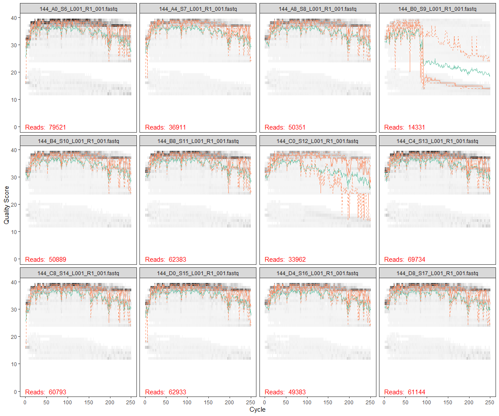
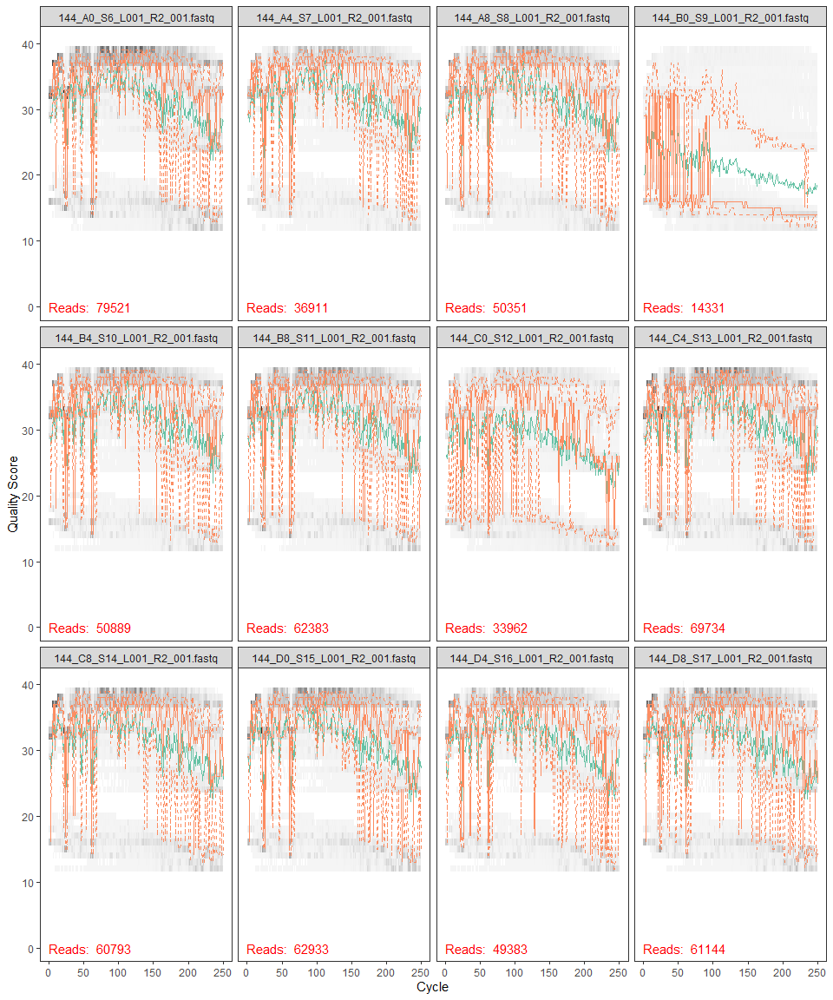

EEMB\_144L\_2018\_DADA2
================
Samantha Chen
11/18/2020

``` r
library(tidyverse)
library(dada2)
library(ShortRead)
```

``` r
path <- "~/GitHub EEMB 144L/144l_students/Input_Data/week5/EEMB144L_2018_fastq/"

fnFs <- list.files(path, pattern = "_R1_001.fastq", full.names = TRUE)
fnRs <- list.files(path, pattern = "_R2_001.fastq", full.names = TRUE)
```

``` r
FWD = "GTGYCAGCMGCCGCGGTAA"
REV = "GGACTACNVGGGTWTCTAAT"

all0rients <- function(primer) {
  require(Biostrings)
  dna <- DNAString(primer)
  orients <- c(Forward = dna, Complement = complement(dna), Reverse = reverse(dna), RevComp = reverseComplement(dna))
  return(sapply(orients, toString))
}

FWD.orients <- all0rients(FWD)
REV.orients <- all0rients(REV)
```

``` r
primerHits <- function(primer, fn) {
  nhits <- vcountPattern(primer, sread(readFastq(fn)), fixed = FALSE)
  return(sum(nhits > 0))
}

rbind(FWD.ForwardReads = sapply(FWD.orients, primerHits, fn = fnFs[[1]]), 
      FWD.ReverseReads = sapply(FWD.orients, primerHits, fn = fnRs[[1]]), 
      REV.ForwardReads = sapply(REV.orients, primerHits, fn = fnFs[[1]]), 
      REV.ReverseReads = sapply(REV.orients, primerHits, fn = fnRs[[1]]))
```

    ##                  Forward Complement Reverse RevComp
    ## FWD.ForwardReads       0          0       0       0
    ## FWD.ReverseReads       0          0       0     283
    ## REV.ForwardReads       0          0       0    1195
    ## REV.ReverseReads       0          0       0       0

## Forward Reads

``` r
plotQualityProfile(fnFs[1:12])
```

<!-- -->

## Reverse Reads

``` r
plotQualityProfile(fnRs[1:12])
```

<!-- -->
\# Filtering and Trimming

``` r
sample.names <- sapply(strsplit(basename(fnFs), "_L"), '[', 1)
sample.names
```

    ##  [1] "144_A0_S6"  "144_A4_S7"  "144_A8_S8"  "144_B0_S9"  "144_B4_S10"
    ##  [6] "144_B8_S11" "144_C0_S12" "144_C4_S13" "144_C8_S14" "144_D0_S15"
    ## [11] "144_D4_S16" "144_D8_S17" "144_E0_S18" "144_E4_S19" "144_E8_S20"
    ## [16] "144_F0_S21" "144_F4_S22" "144_F8_S23" "144_G0_S24" "144_G4_S25"
    ## [21] "144_G8_S26" "144_H0_S27" "144_H4_S28" "144_H8_S29"

``` r
filt_path <- file.path(path, "filtered")
filtFs <- file.path(filt_path, paste0(sample.names, "_F_filt.fastq"))
filtRs <- file.path(filt_path, paste0(sample.names, "_R_filt.fastq"))
```

``` r
out <- filterAndTrim(fnFs, filtFs, fnRs, filtRs, truncLen = c(250,150), maxN = 0, maxEE = c(2,2), truncQ = 2, rm.phix = TRUE, compress = TRUE)

out
```

    ##                              reads.in reads.out
    ## 144_A0_S6_L001_R1_001.fastq     79521     66767
    ## 144_A4_S7_L001_R1_001.fastq     36911     31704
    ## 144_A8_S8_L001_R1_001.fastq     50351     42320
    ## 144_B0_S9_L001_R1_001.fastq     14331      3011
    ## 144_B4_S10_L001_R1_001.fastq    50889     42935
    ## 144_B8_S11_L001_R1_001.fastq    62383     52855
    ## 144_C0_S12_L001_R1_001.fastq    33962     23605
    ## 144_C4_S13_L001_R1_001.fastq    69734     59352
    ## 144_C8_S14_L001_R1_001.fastq    60793     52093
    ## 144_D0_S15_L001_R1_001.fastq    62933     55336
    ## 144_D4_S16_L001_R1_001.fastq    49383     42224
    ## 144_D8_S17_L001_R1_001.fastq    61144     51990
    ## 144_E0_S18_L001_R1_001.fastq    53714     46734
    ## 144_E4_S19_L001_R1_001.fastq    41686     35201
    ## 144_E8_S20_L001_R1_001.fastq    34947     28743
    ## 144_F0_S21_L001_R1_001.fastq    54554     47488
    ## 144_F4_S22_L001_R1_001.fastq    32800     28274
    ## 144_F8_S23_L001_R1_001.fastq    33312     29691
    ## 144_G0_S24_L001_R1_001.fastq    40935     35533
    ## 144_G4_S25_L001_R1_001.fastq    40109     34624
    ## 144_G8_S26_L001_R1_001.fastq    35610     31334
    ## 144_H0_S27_L001_R1_001.fastq    63711     56558
    ## 144_H4_S28_L001_R1_001.fastq    27892     23924
    ## 144_H8_S29_L001_R1_001.fastq    36860     31648

# Error Rates and Plots

``` r
errF <- learnErrors(filtFs, multithread = TRUE)
```

    ## 107494500 total bases in 429978 reads from 10 samples will be used for learning the error rates.

``` r
errR <- learnErrors(filtRs, multithread = TRUE)
```

    ## 102353700 total bases in 682358 reads from 16 samples will be used for learning the error rates.


In my forward reads, the estimated error rates are a good fit to the
observed error rates. As expected, error rates drop as quality
increases. Otherwise, the charts look okay and I can proceed.


In my reverse reads, the estimated error rates are also a good fit to
the observed error rates. Similarly to the forward reads, error rates
drop as quality increases. Otherwise, the charts look okay and I can
proceed.

# Dereplication

``` r
derepFs <- derepFastq(filtFs, verbose = TRUE)
```

    ## Dereplicating sequence entries in Fastq file: ~/GitHub EEMB 144L/144l_students/Input_Data/week5/EEMB144L_2018_fastq//filtered/144_A0_S6_F_filt.fastq

    ## Encountered 19267 unique sequences from 66767 total sequences read.

    ## Dereplicating sequence entries in Fastq file: ~/GitHub EEMB 144L/144l_students/Input_Data/week5/EEMB144L_2018_fastq//filtered/144_A4_S7_F_filt.fastq

    ## Encountered 9371 unique sequences from 31704 total sequences read.

    ## Dereplicating sequence entries in Fastq file: ~/GitHub EEMB 144L/144l_students/Input_Data/week5/EEMB144L_2018_fastq//filtered/144_A8_S8_F_filt.fastq

    ## Encountered 12649 unique sequences from 42320 total sequences read.

    ## Dereplicating sequence entries in Fastq file: ~/GitHub EEMB 144L/144l_students/Input_Data/week5/EEMB144L_2018_fastq//filtered/144_B0_S9_F_filt.fastq

    ## Encountered 1388 unique sequences from 3011 total sequences read.

    ## Dereplicating sequence entries in Fastq file: ~/GitHub EEMB 144L/144l_students/Input_Data/week5/EEMB144L_2018_fastq//filtered/144_B4_S10_F_filt.fastq

    ## Encountered 11989 unique sequences from 42935 total sequences read.

    ## Dereplicating sequence entries in Fastq file: ~/GitHub EEMB 144L/144l_students/Input_Data/week5/EEMB144L_2018_fastq//filtered/144_B8_S11_F_filt.fastq

    ## Encountered 15103 unique sequences from 52855 total sequences read.

    ## Dereplicating sequence entries in Fastq file: ~/GitHub EEMB 144L/144l_students/Input_Data/week5/EEMB144L_2018_fastq//filtered/144_C0_S12_F_filt.fastq

    ## Encountered 8013 unique sequences from 23605 total sequences read.

    ## Dereplicating sequence entries in Fastq file: ~/GitHub EEMB 144L/144l_students/Input_Data/week5/EEMB144L_2018_fastq//filtered/144_C4_S13_F_filt.fastq

    ## Encountered 13898 unique sequences from 59352 total sequences read.

    ## Dereplicating sequence entries in Fastq file: ~/GitHub EEMB 144L/144l_students/Input_Data/week5/EEMB144L_2018_fastq//filtered/144_C8_S14_F_filt.fastq

    ## Encountered 14447 unique sequences from 52093 total sequences read.

    ## Dereplicating sequence entries in Fastq file: ~/GitHub EEMB 144L/144l_students/Input_Data/week5/EEMB144L_2018_fastq//filtered/144_D0_S15_F_filt.fastq

    ## Encountered 15860 unique sequences from 55336 total sequences read.

    ## Dereplicating sequence entries in Fastq file: ~/GitHub EEMB 144L/144l_students/Input_Data/week5/EEMB144L_2018_fastq//filtered/144_D4_S16_F_filt.fastq

    ## Encountered 9611 unique sequences from 42224 total sequences read.

    ## Dereplicating sequence entries in Fastq file: ~/GitHub EEMB 144L/144l_students/Input_Data/week5/EEMB144L_2018_fastq//filtered/144_D8_S17_F_filt.fastq

    ## Encountered 15072 unique sequences from 51990 total sequences read.

    ## Dereplicating sequence entries in Fastq file: ~/GitHub EEMB 144L/144l_students/Input_Data/week5/EEMB144L_2018_fastq//filtered/144_E0_S18_F_filt.fastq

    ## Encountered 13911 unique sequences from 46734 total sequences read.

    ## Dereplicating sequence entries in Fastq file: ~/GitHub EEMB 144L/144l_students/Input_Data/week5/EEMB144L_2018_fastq//filtered/144_E4_S19_F_filt.fastq

    ## Encountered 9659 unique sequences from 35201 total sequences read.

    ## Dereplicating sequence entries in Fastq file: ~/GitHub EEMB 144L/144l_students/Input_Data/week5/EEMB144L_2018_fastq//filtered/144_E8_S20_F_filt.fastq

    ## Encountered 8789 unique sequences from 28743 total sequences read.

    ## Dereplicating sequence entries in Fastq file: ~/GitHub EEMB 144L/144l_students/Input_Data/week5/EEMB144L_2018_fastq//filtered/144_F0_S21_F_filt.fastq

    ## Encountered 14372 unique sequences from 47488 total sequences read.

    ## Dereplicating sequence entries in Fastq file: ~/GitHub EEMB 144L/144l_students/Input_Data/week5/EEMB144L_2018_fastq//filtered/144_F4_S22_F_filt.fastq

    ## Encountered 8210 unique sequences from 28274 total sequences read.

    ## Dereplicating sequence entries in Fastq file: ~/GitHub EEMB 144L/144l_students/Input_Data/week5/EEMB144L_2018_fastq//filtered/144_F8_S23_F_filt.fastq

    ## Encountered 8386 unique sequences from 29691 total sequences read.

    ## Dereplicating sequence entries in Fastq file: ~/GitHub EEMB 144L/144l_students/Input_Data/week5/EEMB144L_2018_fastq//filtered/144_G0_S24_F_filt.fastq

    ## Encountered 10989 unique sequences from 35533 total sequences read.

    ## Dereplicating sequence entries in Fastq file: ~/GitHub EEMB 144L/144l_students/Input_Data/week5/EEMB144L_2018_fastq//filtered/144_G4_S25_F_filt.fastq

    ## Encountered 8645 unique sequences from 34624 total sequences read.

    ## Dereplicating sequence entries in Fastq file: ~/GitHub EEMB 144L/144l_students/Input_Data/week5/EEMB144L_2018_fastq//filtered/144_G8_S26_F_filt.fastq

    ## Encountered 8709 unique sequences from 31334 total sequences read.

    ## Dereplicating sequence entries in Fastq file: ~/GitHub EEMB 144L/144l_students/Input_Data/week5/EEMB144L_2018_fastq//filtered/144_H0_S27_F_filt.fastq

    ## Encountered 15384 unique sequences from 56558 total sequences read.

    ## Dereplicating sequence entries in Fastq file: ~/GitHub EEMB 144L/144l_students/Input_Data/week5/EEMB144L_2018_fastq//filtered/144_H4_S28_F_filt.fastq

    ## Encountered 6054 unique sequences from 23924 total sequences read.

    ## Dereplicating sequence entries in Fastq file: ~/GitHub EEMB 144L/144l_students/Input_Data/week5/EEMB144L_2018_fastq//filtered/144_H8_S29_F_filt.fastq

    ## Encountered 9804 unique sequences from 31648 total sequences read.

``` r
derepRs <- derepFastq(filtRs, verbose = TRUE)
```

    ## Dereplicating sequence entries in Fastq file: ~/GitHub EEMB 144L/144l_students/Input_Data/week5/EEMB144L_2018_fastq//filtered/144_A0_S6_R_filt.fastq

    ## Encountered 21716 unique sequences from 66767 total sequences read.

    ## Dereplicating sequence entries in Fastq file: ~/GitHub EEMB 144L/144l_students/Input_Data/week5/EEMB144L_2018_fastq//filtered/144_A4_S7_R_filt.fastq

    ## Encountered 10342 unique sequences from 31704 total sequences read.

    ## Dereplicating sequence entries in Fastq file: ~/GitHub EEMB 144L/144l_students/Input_Data/week5/EEMB144L_2018_fastq//filtered/144_A8_S8_R_filt.fastq

    ## Encountered 14767 unique sequences from 42320 total sequences read.

    ## Dereplicating sequence entries in Fastq file: ~/GitHub EEMB 144L/144l_students/Input_Data/week5/EEMB144L_2018_fastq//filtered/144_B0_S9_R_filt.fastq

    ## Encountered 1554 unique sequences from 3011 total sequences read.

    ## Dereplicating sequence entries in Fastq file: ~/GitHub EEMB 144L/144l_students/Input_Data/week5/EEMB144L_2018_fastq//filtered/144_B4_S10_R_filt.fastq

    ## Encountered 13943 unique sequences from 42935 total sequences read.

    ## Dereplicating sequence entries in Fastq file: ~/GitHub EEMB 144L/144l_students/Input_Data/week5/EEMB144L_2018_fastq//filtered/144_B8_S11_R_filt.fastq

    ## Encountered 18519 unique sequences from 52855 total sequences read.

    ## Dereplicating sequence entries in Fastq file: ~/GitHub EEMB 144L/144l_students/Input_Data/week5/EEMB144L_2018_fastq//filtered/144_C0_S12_R_filt.fastq

    ## Encountered 10981 unique sequences from 23605 total sequences read.

    ## Dereplicating sequence entries in Fastq file: ~/GitHub EEMB 144L/144l_students/Input_Data/week5/EEMB144L_2018_fastq//filtered/144_C4_S13_R_filt.fastq

    ## Encountered 17274 unique sequences from 59352 total sequences read.

    ## Dereplicating sequence entries in Fastq file: ~/GitHub EEMB 144L/144l_students/Input_Data/week5/EEMB144L_2018_fastq//filtered/144_C8_S14_R_filt.fastq

    ## Encountered 17183 unique sequences from 52093 total sequences read.

    ## Dereplicating sequence entries in Fastq file: ~/GitHub EEMB 144L/144l_students/Input_Data/week5/EEMB144L_2018_fastq//filtered/144_D0_S15_R_filt.fastq

    ## Encountered 19420 unique sequences from 55336 total sequences read.

    ## Dereplicating sequence entries in Fastq file: ~/GitHub EEMB 144L/144l_students/Input_Data/week5/EEMB144L_2018_fastq//filtered/144_D4_S16_R_filt.fastq

    ## Encountered 13337 unique sequences from 42224 total sequences read.

    ## Dereplicating sequence entries in Fastq file: ~/GitHub EEMB 144L/144l_students/Input_Data/week5/EEMB144L_2018_fastq//filtered/144_D8_S17_R_filt.fastq

    ## Encountered 19119 unique sequences from 51990 total sequences read.

    ## Dereplicating sequence entries in Fastq file: ~/GitHub EEMB 144L/144l_students/Input_Data/week5/EEMB144L_2018_fastq//filtered/144_E0_S18_R_filt.fastq

    ## Encountered 17243 unique sequences from 46734 total sequences read.

    ## Dereplicating sequence entries in Fastq file: ~/GitHub EEMB 144L/144l_students/Input_Data/week5/EEMB144L_2018_fastq//filtered/144_E4_S19_R_filt.fastq

    ## Encountered 13140 unique sequences from 35201 total sequences read.

    ## Dereplicating sequence entries in Fastq file: ~/GitHub EEMB 144L/144l_students/Input_Data/week5/EEMB144L_2018_fastq//filtered/144_E8_S20_R_filt.fastq

    ## Encountered 14474 unique sequences from 28743 total sequences read.

    ## Dereplicating sequence entries in Fastq file: ~/GitHub EEMB 144L/144l_students/Input_Data/week5/EEMB144L_2018_fastq//filtered/144_F0_S21_R_filt.fastq

    ## Encountered 18128 unique sequences from 47488 total sequences read.

    ## Dereplicating sequence entries in Fastq file: ~/GitHub EEMB 144L/144l_students/Input_Data/week5/EEMB144L_2018_fastq//filtered/144_F4_S22_R_filt.fastq

    ## Encountered 9431 unique sequences from 28274 total sequences read.

    ## Dereplicating sequence entries in Fastq file: ~/GitHub EEMB 144L/144l_students/Input_Data/week5/EEMB144L_2018_fastq//filtered/144_F8_S23_R_filt.fastq

    ## Encountered 9474 unique sequences from 29691 total sequences read.

    ## Dereplicating sequence entries in Fastq file: ~/GitHub EEMB 144L/144l_students/Input_Data/week5/EEMB144L_2018_fastq//filtered/144_G0_S24_R_filt.fastq

    ## Encountered 12741 unique sequences from 35533 total sequences read.

    ## Dereplicating sequence entries in Fastq file: ~/GitHub EEMB 144L/144l_students/Input_Data/week5/EEMB144L_2018_fastq//filtered/144_G4_S25_R_filt.fastq

    ## Encountered 11290 unique sequences from 34624 total sequences read.

    ## Dereplicating sequence entries in Fastq file: ~/GitHub EEMB 144L/144l_students/Input_Data/week5/EEMB144L_2018_fastq//filtered/144_G8_S26_R_filt.fastq

    ## Encountered 9935 unique sequences from 31334 total sequences read.

    ## Dereplicating sequence entries in Fastq file: ~/GitHub EEMB 144L/144l_students/Input_Data/week5/EEMB144L_2018_fastq//filtered/144_H0_S27_R_filt.fastq

    ## Encountered 19024 unique sequences from 56558 total sequences read.

    ## Dereplicating sequence entries in Fastq file: ~/GitHub EEMB 144L/144l_students/Input_Data/week5/EEMB144L_2018_fastq//filtered/144_H4_S28_R_filt.fastq

    ## Encountered 9572 unique sequences from 23924 total sequences read.

    ## Dereplicating sequence entries in Fastq file: ~/GitHub EEMB 144L/144l_students/Input_Data/week5/EEMB144L_2018_fastq//filtered/144_H8_S29_R_filt.fastq

    ## Encountered 10951 unique sequences from 31648 total sequences read.

``` r
names(derepFs) <- sample.names
names(derepRs) <- sample.names
```

``` r
dadaFs <- dada(derepFs, err = errF, multithread = TRUE)
```

    ## Sample 1 - 66767 reads in 19267 unique sequences.
    ## Sample 2 - 31704 reads in 9371 unique sequences.
    ## Sample 3 - 42320 reads in 12649 unique sequences.
    ## Sample 4 - 3011 reads in 1388 unique sequences.
    ## Sample 5 - 42935 reads in 11989 unique sequences.
    ## Sample 6 - 52855 reads in 15103 unique sequences.
    ## Sample 7 - 23605 reads in 8013 unique sequences.
    ## Sample 8 - 59352 reads in 13898 unique sequences.
    ## Sample 9 - 52093 reads in 14447 unique sequences.
    ## Sample 10 - 55336 reads in 15860 unique sequences.
    ## Sample 11 - 42224 reads in 9611 unique sequences.
    ## Sample 12 - 51990 reads in 15072 unique sequences.
    ## Sample 13 - 46734 reads in 13911 unique sequences.
    ## Sample 14 - 35201 reads in 9659 unique sequences.
    ## Sample 15 - 28743 reads in 8789 unique sequences.
    ## Sample 16 - 47488 reads in 14372 unique sequences.
    ## Sample 17 - 28274 reads in 8210 unique sequences.
    ## Sample 18 - 29691 reads in 8386 unique sequences.
    ## Sample 19 - 35533 reads in 10989 unique sequences.
    ## Sample 20 - 34624 reads in 8645 unique sequences.
    ## Sample 21 - 31334 reads in 8709 unique sequences.
    ## Sample 22 - 56558 reads in 15384 unique sequences.
    ## Sample 23 - 23924 reads in 6054 unique sequences.
    ## Sample 24 - 31648 reads in 9804 unique sequences.

``` r
dadaRs <- dada(derepRs, err = errR, multithread = TRUE)
```

    ## Sample 1 - 66767 reads in 21716 unique sequences.
    ## Sample 2 - 31704 reads in 10342 unique sequences.
    ## Sample 3 - 42320 reads in 14767 unique sequences.
    ## Sample 4 - 3011 reads in 1554 unique sequences.
    ## Sample 5 - 42935 reads in 13943 unique sequences.
    ## Sample 6 - 52855 reads in 18519 unique sequences.
    ## Sample 7 - 23605 reads in 10981 unique sequences.
    ## Sample 8 - 59352 reads in 17274 unique sequences.
    ## Sample 9 - 52093 reads in 17183 unique sequences.
    ## Sample 10 - 55336 reads in 19420 unique sequences.
    ## Sample 11 - 42224 reads in 13337 unique sequences.
    ## Sample 12 - 51990 reads in 19119 unique sequences.
    ## Sample 13 - 46734 reads in 17243 unique sequences.
    ## Sample 14 - 35201 reads in 13140 unique sequences.
    ## Sample 15 - 28743 reads in 14474 unique sequences.
    ## Sample 16 - 47488 reads in 18128 unique sequences.
    ## Sample 17 - 28274 reads in 9431 unique sequences.
    ## Sample 18 - 29691 reads in 9474 unique sequences.
    ## Sample 19 - 35533 reads in 12741 unique sequences.
    ## Sample 20 - 34624 reads in 11290 unique sequences.
    ## Sample 21 - 31334 reads in 9935 unique sequences.
    ## Sample 22 - 56558 reads in 19024 unique sequences.
    ## Sample 23 - 23924 reads in 9572 unique sequences.
    ## Sample 24 - 31648 reads in 10951 unique sequences.

``` r
mergers <- mergePairs(dadaFs, derepFs, dadaRs, derepRs, verbose = TRUE, trimOverhang = T)
```

    ## 56812 paired-reads (in 285 unique pairings) successfully merged out of 66070 (in 772 pairings) input.

    ## 28477 paired-reads (in 153 unique pairings) successfully merged out of 31204 (in 408 pairings) input.

    ## 36740 paired-reads (in 190 unique pairings) successfully merged out of 41724 (in 501 pairings) input.

    ## 2349 paired-reads (in 65 unique pairings) successfully merged out of 2794 (in 145 pairings) input.

    ## 37708 paired-reads (in 166 unique pairings) successfully merged out of 42311 (in 449 pairings) input.

    ## 45702 paired-reads (in 211 unique pairings) successfully merged out of 52268 (in 593 pairings) input.

    ## 20087 paired-reads (in 182 unique pairings) successfully merged out of 23166 (in 439 pairings) input.

    ## 55604 paired-reads (in 153 unique pairings) successfully merged out of 58736 (in 423 pairings) input.

    ## 49346 paired-reads (in 210 unique pairings) successfully merged out of 51625 (in 508 pairings) input.

    ## 47991 paired-reads (in 261 unique pairings) successfully merged out of 54710 (in 634 pairings) input.

    ## 40376 paired-reads (in 119 unique pairings) successfully merged out of 41824 (in 299 pairings) input.

    ## 48993 paired-reads (in 210 unique pairings) successfully merged out of 51538 (in 490 pairings) input.

    ## 40584 paired-reads (in 226 unique pairings) successfully merged out of 46092 (in 541 pairings) input.

    ## 32497 paired-reads (in 148 unique pairings) successfully merged out of 34805 (in 362 pairings) input.

    ## 25848 paired-reads (in 144 unique pairings) successfully merged out of 28203 (in 456 pairings) input.

    ## 38222 paired-reads (in 213 unique pairings) successfully merged out of 46720 (in 590 pairings) input.

    ## 25593 paired-reads (in 124 unique pairings) successfully merged out of 27971 (in 263 pairings) input.

    ## 26994 paired-reads (in 169 unique pairings) successfully merged out of 29334 (in 334 pairings) input.

    ## 29424 paired-reads (in 191 unique pairings) successfully merged out of 34898 (in 394 pairings) input.

    ## 32298 paired-reads (in 125 unique pairings) successfully merged out of 34252 (in 330 pairings) input.

    ## 28436 paired-reads (in 139 unique pairings) successfully merged out of 30981 (in 285 pairings) input.

    ## 40175 paired-reads (in 236 unique pairings) successfully merged out of 55594 (in 573 pairings) input.

    ## 22501 paired-reads (in 109 unique pairings) successfully merged out of 23588 (in 260 pairings) input.

    ## 28034 paired-reads (in 149 unique pairings) successfully merged out of 31286 (in 298 pairings) input.

``` r
head(mergers[[1]])
```

    ##                                                                                                                                                                                                                                                        sequence
    ## 1 TACGGAGGGTGCAAGCGTTACTCGGAATCACTGGGCGTAAAGAGCGTGTAGGCGGATAGTTAAGTTTGAAGTGAAATCCTATGGCTCAACCATAGAACTGCTTTGAAAACTGATTATCTAGAATATGGGAGAGGTAGATGGAATTTCTGGTGTAGGGGTAAAATCCGTAGAGATCAGAAGGAATACCGATTGCGAAGGCGATCTACTGGAACATTATTGACGCTGAGACGCGAAAGCGTGGGGAGCAAACAGG
    ## 2 TACGGAGGGTCCGAGCGTTAATCGGAATTACTGGGCGTAAAGCGCGCGTAGGTGGTTTTGTCAGTCAGATGTGAAAGCCCAGGGCTCAACCTTGGAACTGCACCTGATACTGCAAGACTAGAGTACAATAGAGGGGAGTGGAATTTCCGGTGTAGCGGTGAAATGCGTAGAGATCGGAAGGAACACCAGTGGCGAAGGCGACTCCCTGGATTGATACTGACACTGAGGTGCGAAAGCGTGGGGAGCAAACAGG
    ## 3 TACGAAGGGACCTAGCGTAGTTCGGAATTACTGGGCTTAAAGAGTTCGTAGGTGGTTGAAAAAGTTAGTGGTGAAATCCCAGAGCTTAACTCTGGAACTGCCATTAAAACTTTTCAGCTAGAGTATGATAGAGGAAAGCAGAATTTCTAGTGTAGAGGTGAAATTCGTAGATATTAGAAAGAATACCAATTGCGAAGGCAGCTTTCTGGATCATTACTGACACTGAGGAACGAAAGCATGGGTAGCGAAGAGG
    ## 4 TACGGAAGGTGCAAGCGTTAATCGGAATTACTGGGCGTAAAGCGCGCGTAGGTGGTTTGTTAAGTTGGATGTGAAAGCCCTGGGCTCAACCTAGGAACTGCATCCAAAACTAACTCACTAGAGTACGATAGAGGGAGGTAGAATTCATAGTGTAGCGGTGGAATGCGTAGATATTATGAAGAATACCAGTGGCGAAGGCGGCCTCCTGGATCTGTACTGACACTGAGGTGCGAAAGCGTGGGTAGCGAACAGG
    ## 6 TACGGGAGTGGCAAGCGTTATCCGGAATTATTGGGCGTAAAGCGTCCGCAGGCGGCCCTTCAAGTCTGCTGTTAAAAAGTGGAGCTTAACTCCATCATGGCAGTGGAAACTGAGGGGCTTGAGTGTGGTAGGGGCAGAGGGAATTCCCGGTGTAGCGGTGAAATGCGTAGATATCGGGAAGAACACCAGTGGCGAAGGCGCTCTGCTGGGCCATCACTGACGCTCATGGACGAAAGCCAGGGGAGCGAAAGGG
    ## 7 TACGGAAGGTCCAAGCGTTAATCGGAATTACTGGGCGTAAAGCGCGCGTAGGTGGTTTATTAAGTTGGATGTGAAATCCCCGGGCTCAACCTGGGAACTGCATCCAAAACTGATTCACTAGAGTACGATAGAGGGAGGTAGAATTCACAGTGTAGCGGTGGAATGCGTAGATATTGTGAAGAATACCAATGGCGAAGGCAGCCTCCTGGATCTGTACTGACACTGAGGTGCGAAAGCGTGGGTAGCGAACAGG
    ##   abundance forward reverse nmatch nmismatch nindel prefer accept
    ## 1      3568       2       1    147         0      0      1   TRUE
    ## 2      3567       3       3    147         0      0      1   TRUE
    ## 3      3009       1       2    147         0      0      1   TRUE
    ## 4      2977       4       4    147         0      0      1   TRUE
    ## 6      2192       5       6    147         0      0      1   TRUE
    ## 7      1835       6       9    147         0      0      1   TRUE

``` r
saveRDS(mergers, "~/GitHub EEMB 144L/144l_students/Output_Data/week 5/dada_merged.rds")
saveRDS(mergers, "~/GitHub EEMB 144L/144l_students/Output_Data/week 6/dada_merged.rds")
```

# Sequence Table

``` r
seqtab <- makeSequenceTable(mergers)
dim(seqtab)
```

    ## [1]  24 806

``` r
table(nchar(getSequences(seqtab)))
```

    ## 
    ## 252 253 254 255 256 257 258 265 266 270 373 
    ##  20 732  39   2   4   1   3   1   1   2   1

# Removing Chimeras

``` r
seqtab.nochim <- removeBimeraDenovo(seqtab, verbose = TRUE)
```

    ## Identified 45 bimeras out of 806 input sequences.

``` r
dim(seqtab.nochim)
```

    ## [1]  24 761

``` r
sum(seqtab.nochim)/sum(seqtab)
```

    ## [1] 0.9953127

# Taxonomy

``` r
taxa <- assignTaxonomy(seqtab.nochim, "~/GitHub EEMB 144L/144l_students/Input_Data/week5/Reference_Database/silva_nr_v138_train_set.fa", multithread = TRUE)
```

``` r
saveRDS(t(seqtab.nochim), "~/GitHub EEMB 144L/144l_students/Output_Data/week 5/seqtab-nochimtaxa.rds")
saveRDS(taxa,"~/GitHub EEMB 144L/144l_students/Output_Data/week 5/taxa.rds")
saveRDS(t(seqtab.nochim), "~/GitHub EEMB 144L/144l_students/Input_Data/week6/seqtab-nochimtaxa.rds")
saveRDS(taxa,"~/GitHub EEMB 144L/144l_students/Input_Data/week6/taxa.rds")
```
