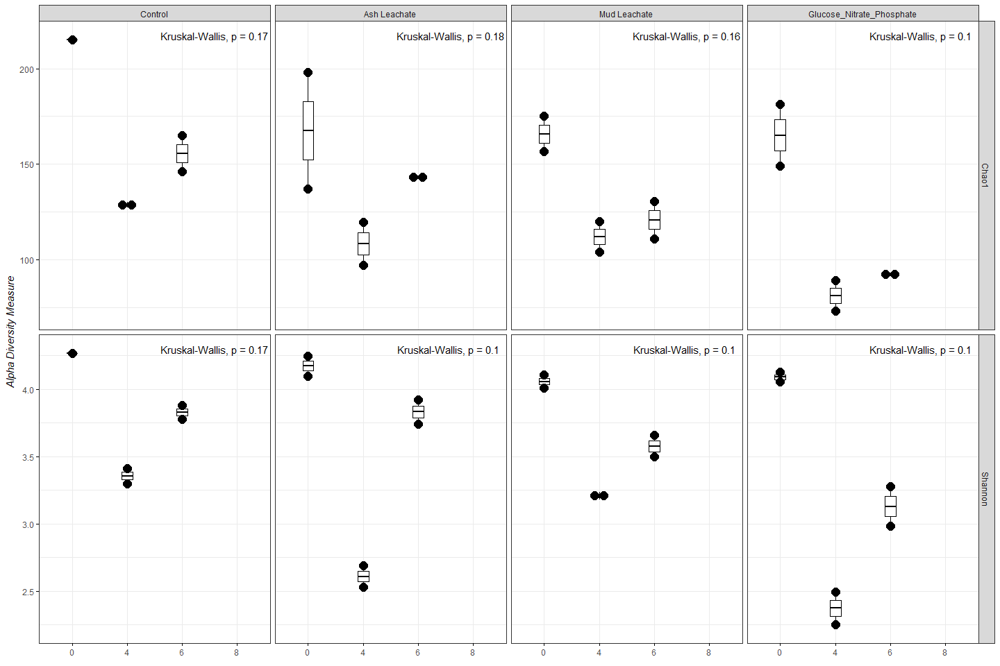
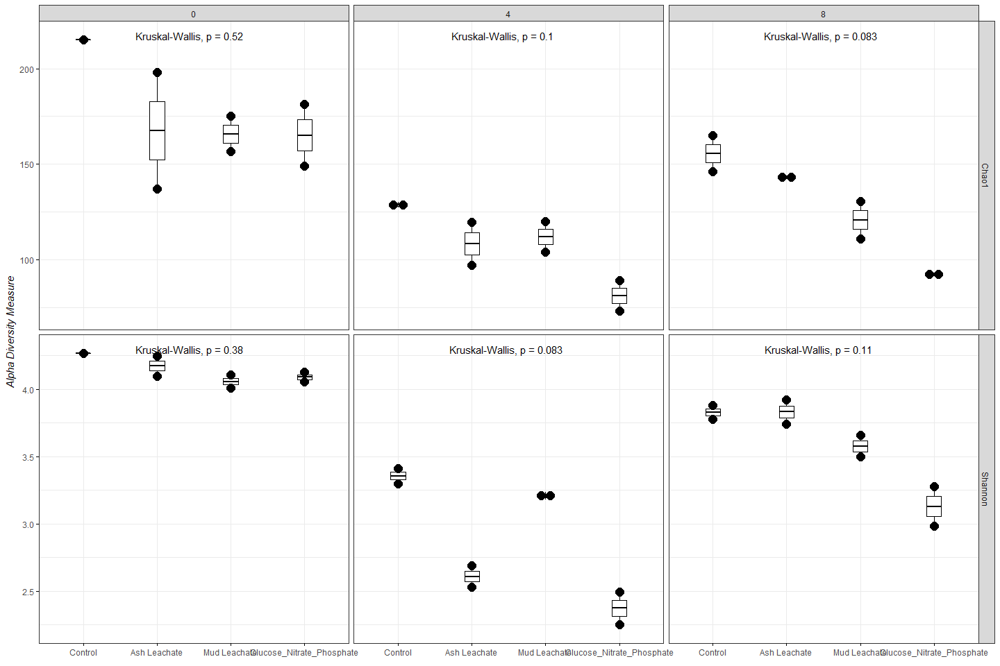
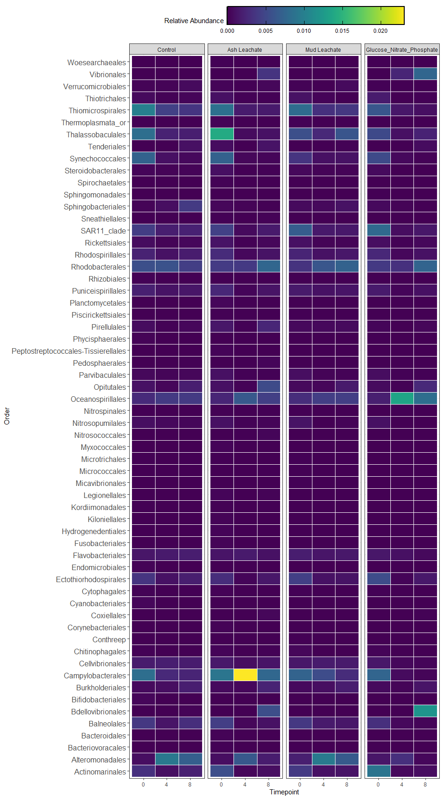

Phyloseq
================
Samantha Chen
11/24/2020

# Prepatory Work

``` r
#BiocManager::install("phyloseq")
library(tidyverse)
library(RColorBrewer)
library(phyloseq)
library(ggplot2)
library(readxl)
```

``` r
count.tab <- read_rds("~/GitHub EEMB 144L/144l_students/Input_Data/week6/seqtab-nochimtaxa.rds")
tax.tab <- read_rds("~/GitHub EEMB 144L/144l_students/Input_Data/week6/taxa.rds")
sample.tab <- read_rds("~/GitHub EEMB 144L/144l_students/Output_Data/week 4/2018_TOC_files/2018_TOC.rds")

TOC_2018 <- read_excel("~/GitHub EEMB 144L/144l_students/Input_Data/week4/144L_2018_Exp_TOC.xlsx") %>% 
  select(Treatment, Bottle, Timepoint, DNA_SampleID)
sample.tab <- left_join(sample.tab, TOC_2018) %>% 
  drop_na(DNA_SampleID) %>% 
  column_to_rownames(var = "DNA_SampleID")
```

# Phyloseq Object

``` r
OTU = otu_table(count.tab, taxa_are_rows = TRUE)
TAX = tax_table(tax.tab)
SAM = sample_data(sample.tab)
ps = phyloseq(OTU, TAX, SAM)
```

# Filtered Sequences

``` r
sub_ps <- ps %>%
  subset_samples(Bottle != "B" | Timepoint != 0) %>% 
  subset_taxa(Family !=  "mitochondria" & Order != "Chloroplast")
```

# Sample Summary

``` r
sample_sum_df <- data.frame(sum = sample_sums(sub_ps))

ggplot(sample_sum_df, aes(x = sum)) +
  geom_histogram(color = "black", fill = "#bebada", binwidth = 3000) +
  ggtitle("Distribution of sample sequencing depth") +
  xlab("Read counts") +
  theme(axis.title.y = element_blank()) +
  theme_bw()
```

<!-- --> The read
depths of my data follows a regular bell shape curved indicating similar
read depths among each sample. There are sample with 2000 read counts,
which I had subset so that it does not affect subsampling. Most of the
samples have read counts between 20000 to 60000.

``` r
summary(sample_sum_df)
```

    ##       sum       
    ##  Min.   :15616  
    ##  1st Qu.:23649  
    ##  Median :29902  
    ##  Mean   :29480  
    ##  3rd Qu.:33284  
    ##  Max.   :53040

# Beta Diversity

``` r
ps_min <- rarefy_even_depth(sub_ps, sample.size = min(sample_sums(sub_ps)))
```

    ## You set `rngseed` to FALSE. Make sure you've set & recorded
    ##  the random seed of your session for reproducibility.
    ## See `?set.seed`

    ## ...

    ## 17OTUs were removed because they are no longer 
    ## present in any sample after random subsampling

    ## ...

``` r
mean(sample_sums(sub_ps))
```

    ## [1] 29480.17

``` r
mean(sample_sums(ps_min))
```

    ## [1] 15616

## NMDS

``` r
set.seed(1)

nmds <- ordinate(sub_ps, method = "NMDS", distance = "bray") #Stress = 0.08
```

    ## Square root transformation
    ## Wisconsin double standardization
    ## Run 0 stress 0.07170242 
    ## Run 1 stress 0.1417535 
    ## Run 2 stress 0.07170244 
    ## ... Procrustes: rmse 4.809876e-05  max resid 9.19084e-05 
    ## ... Similar to previous best
    ## Run 3 stress 0.08743668 
    ## Run 4 stress 0.07170242 
    ## ... Procrustes: rmse 9.674894e-06  max resid 1.837929e-05 
    ## ... Similar to previous best
    ## Run 5 stress 0.2493769 
    ## Run 6 stress 0.08307698 
    ## Run 7 stress 0.07918117 
    ## Run 8 stress 0.07339654 
    ## Run 9 stress 0.08743679 
    ## Run 10 stress 0.08307698 
    ## Run 11 stress 0.1483673 
    ## Run 12 stress 0.07339653 
    ## Run 13 stress 0.08307697 
    ## Run 14 stress 0.08307697 
    ## Run 15 stress 0.08547509 
    ## Run 16 stress 0.07339653 
    ## Run 17 stress 0.172878 
    ## Run 18 stress 0.07170242 
    ## ... Procrustes: rmse 2.20899e-05  max resid 4.339608e-05 
    ## ... Similar to previous best
    ## Run 19 stress 0.08721046 
    ## Run 20 stress 0.08743611 
    ## *** Solution reached

``` r
set.seed(1)

nmds_min <- ordinate(ps_min, method = "NMDS", distance = "bray") #Stress = 0.08
```

    ## Square root transformation
    ## Wisconsin double standardization
    ## Run 0 stress 0.07562179 
    ## Run 1 stress 0.1660838 
    ## Run 2 stress 0.0756217 
    ## ... New best solution
    ## ... Procrustes: rmse 8.020454e-05  max resid 0.000291995 
    ## ... Similar to previous best
    ## Run 3 stress 0.09030099 
    ## Run 4 stress 0.08075485 
    ## Run 5 stress 0.2478671 
    ## Run 6 stress 0.09030056 
    ## Run 7 stress 0.07866644 
    ## Run 8 stress 0.080755 
    ## Run 9 stress 0.1621912 
    ## Run 10 stress 0.09069099 
    ## Run 11 stress 0.2420062 
    ## Run 12 stress 0.2274375 
    ## Run 13 stress 0.09797403 
    ## Run 14 stress 0.09797455 
    ## Run 15 stress 0.09255393 
    ## Run 16 stress 0.09030175 
    ## Run 17 stress 0.07866342 
    ## Run 18 stress 0.09305522 
    ## Run 19 stress 0.09030053 
    ## Run 20 stress 0.102182 
    ## *** Solution reached

``` r
levels <- c("Control", "Ash Leachate", "Mud Leachate", "Glucose_Nitrate_Phosphate")

nmds.plot <- plot_ordination(sub_ps, nmds, title = "NMDS") +
  geom_point(aes(fill = days, shape = factor(Treatment, levels = levels)), alpha = 0.6, stroke = 2, size = 4) +
  scale_shape_manual(values = c(21, 22, 23, 24)) +
  scale_fill_gradient(low = "#66c2a5", high = "#fc8d62") +
  theme_bw()

nmds.plot$layers <- nmds.plot$layers[-1]

nmds.plot
```

-1.png)<!-- -->

``` r
levels <- c("Control", "Ash Leachate", "Mud Leachate", "Glucose_Nitrate_Phosphate")

nmds_min.plot <- plot_ordination(ps_min, nmds_min, title = "Subsample NMDS") +
  geom_point(aes(fill = days, shape = factor(Treatment, levels = levels)), alpha = 0.6, stroke = 2, size = 4) +
  scale_shape_manual(values = c(21, 22, 23, 24)) +
  scale_fill_gradient(low = "#66c2a5", high = "#fc8d62") +
  theme_bw()

nmds_min.plot$layers <- nmds_min.plot$layers[-1]

nmds_min.plot
```

-1.png)<!-- -->

# Alpha Diversity

``` r
richness <- estimate_richness(ps_min, measures = c("Chao1", "Shannon")) %>% 
  rownames_to_column(., var = "DNA_ID") %>% 
  mutate_at(vars(DNA_ID), str_replace_all, pattern = "X144", "144")


alphadiv <- left_join(richness, sample.tab %>% rownames_to_column(., var = "DNA_ID"))
```

    ## Joining, by = "DNA_ID"

``` r
#install.packages("ggpubr")
library(ggpubr)

pivot.data <- alphadiv %>% 
  select(Treatment, Bottle, Timepoint, days, Chao1, Shannon) %>% 
  pivot_longer(., cols = c(Chao1, Shannon), names_to = "measure", values_to = "est") %>% 
  left_join(., alphadiv %>% 
              select(Treatment, Bottle, Timepoint, days, se.chao1)) %>% 
  mutate(se.chao1 = ifelse(measure == "Chao1", se.chao1, NA))

alpha.plot <- ggboxplot(pivot.data, x = "Timepoint", y = "est",
                        xlab = expression(italic(paste(""))),
                        ylab = expression(italic(paste("Alpha Diversity Measure"))),
                        add = "dotplot",
                        width = 0.2,
                        ggtheme = theme_bw()) +
  stat_compare_means(label.x = "6") +
  facet_grid(measure~ factor(Treatment, levels = levels), scales = "free")

alpha.plot
```

<!-- -->

Chao1 indicates richness decreased overall in the Ash, Mud, and GNP
samples. My Shannon Index also shows an overall decrease in diversity in
the same three samples. What is interesting, is that diversity decreases
by a lot around day 4 but increases at around day 6. Control showed a
small decrease in richness and diversity. This tells me that compared to
the control, the ash, mud, and GNP communities had less ASV’s and were
dominated by fewer of them. However, I must be cautious using this data
to make assumptions as the p level in all of the samples are greater
than p = 0.05.

``` r
alpha.plot2 <-  ggboxplot(pivot.data, x = "Treatment", y = "est",
            xlab = expression(italic(paste(""))), 
            ylab = expression(italic(paste("Alpha Diversity Measure"))),
            add = "dotplot",
            width = 0.2,
            ggtheme = theme_bw()) +  
  stat_compare_means(label.x = "Ash Leachate") +
  facet_grid(measure~Timepoint, scales = "free") 
alpha.plot2
```

    ## `stat_bindot()` using `bins = 30`. Pick better value with `binwidth`.

<!-- -->

From this plot, the first thing I notice is in time 0, the evenness is
lower in all three treatments compared to the control. This tells me
that this was an issue in quality control. In Day 4, there was a
significant decrease in diversity in treatments compared to the control.
In Day 6, there was a significant decrease in richness in treatments
compared to the control. Overall, by Day 6, the treatments had less
ASV’s and were dominated by fewer of them.

# Taxanomic

Important: recovered 16S rRNA gene copy numbers do not equal organism
abundance

## Relative Abundances

``` r
ps_std <- transform_sample_counts(ps_min, function(x) x/sum(x))
ps_std.tab <- as(otu_table(ps_std), "matrix")
ps_std.df = as.data.frame(ps_std.tab)
```

## Relative Abundance Table

``` r
tax.df <-  as.data.frame(tax.tab) 

custom.tab <- tax.df %>% 
  rownames_to_column(., var = "asv") %>% 
  left_join(., ps_std.df %>% rownames_to_column(., var = "asv")) %>% 
  mutate(pcof = paste(Phylum, "_", Class, "_", Order,"_", Family)) %>% 
  group_by(pcof) %>% 
  select(-c(asv:Genus)) %>% 
  relocate(pcof, .before = "144_A0_S6") %>% 
  ungroup()
```

    ## Joining, by = "asv"

``` r
colnames <- custom.tab[,1]

t_custom.tab <- as.data.frame(t(custom.tab[-1]))
colnames(t_custom.tab) <- colnames$pcof
```

``` r
sweet.tab <- t_custom.tab %>% 
  rownames_to_column(., var = "sample") %>% 
  left_join(., sample.tab %>% rownames_to_column(., var = "sample") %>% select(sample, Experiment, Bottle, Treatment, Timepoint, days, cells)) %>% 
  select(sample, Experiment:cells, everything())

relabund <- sweet.tab %>%
  select(-c(sample:cells)) 

i <- (colSums(relabund, na.rm=T) != 0)

nonzero <- relabund[, i]


relabund2 <- nonzero %>% 
  .[, order(colSums(-.))] %>%
  #.[, colSums(.) > 0] %>%
  bind_cols(sweet.tab %>% select(sample:cells), .)
```

## Heatmap

``` r
relaheat.data <- relabund2 %>% 
  select(-c(sample, Experiment, Bottle, days, cells)) %>%
  pivot_longer(.,-c(Treatment:Timepoint), names_to = "taxa", values_to = "relabund") %>% 
  separate(taxa, into = c("p", "c", "o"), sep = " _ ") %>% 
  group_by(Treatment, Timepoint, p, c, o) %>% 
  mutate(mean_relabund = mean(relabund, na.rm = T)) %>% 
  ungroup() %>% 
  select(-relabund) %>% 
  distinct()
```

    ## Warning: Expected 3 pieces. Additional pieces discarded in 11983 rows [1, 2, 3,
    ## 4, 5, 6, 7, 8, 9, 10, 11, 12, 13, 14, 15, 16, 17, 18, 19, 20, ...].

``` r
#install.packages("viridis")
library(viridis)
```

``` r
relaheat <- relaheat.data %>%
  ggplot(aes(x = as.character(Timepoint), y = o)) +
  geom_tile(aes(fill = mean_relabund), color = "white") +
  scale_fill_viridis(option = "D") +
  labs(x = "Timepoint", y = "Order", fill = "Relative Abundance") +
facet_grid(~factor(Treatment, levels = levels)) +
  theme_bw() +
  theme(axis.text.y = element_text(size = 12),
        legend.position = "top") +
   guides(fill = guide_colourbar(barheight = 2, barwidth = 20, frame.colour = "black", frame.linewidth = 2,ticks.colour = "black", ticks.linewidth = 1), color = F) 
relaheat
```

<!-- -->

Might mean everything else around it died and kept the same relative
abundance. Camplyo possibly eutrophic/responds better to ash but
something outcompetes it grew in response to ASH SAR11 is oligotrophic =
stayed the same and other taxa increased in relative abundance therefore
its own relative abundance

# Save

``` r
saveRDS(sweet.tab, "~/GitHub EEMB 144L/144l_students/Output_Data/week 6/Custom_ASV_Table.rds")
saveRDS(sub_ps, "~/GitHub EEMB 144L/144l_students/Output_Data/week 6/phyloseq_obj.rds")
saveRDS(ps_min, "~/GitHub EEMB 144L/144l_students/Output_Data/week 6/subsampled_phyloseq_obj.rds")
saveRDS(alphadiv, "~/GitHub EEMB 144L/144l_students/Output_Data/week 6/alphadiv.rds")
```
